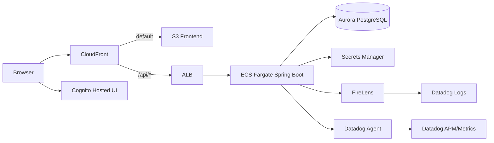

# Todo Application on AWS ECS with Observability

本リポジトリは、[rafty/Todo-ECS-Sample](https://github.com/rafty/Todo-ECS-Sample.git) をベースに、Datadog 連携を含む Observability 構成を追加したサンプルです。

## システム概要



## 最初に読むドキュメント

1. 全体入口: [docs/README.md](./docs/README.md)
2. AWS デプロイ手順: [docs/development/aws-deployment-manual.md](./docs/development/aws-deployment-manual.md)
3. サブプロジェクト入口:
   - [backend/README.md](./backend/README.md)
   - [frontend/README.md](./frontend/README.md)
   - [infra/README.md](./infra/README.md)
4. Observability 仕様:
   - [docs/infra/o11y.md](./docs/infra/o11y.md)
   - [docs/adr/](./docs/adr/)
5. 負荷テスト関連:
   - [DLT デプロイ手順](./docs/load-test/load-test-deployment.md)
   - [負荷テスト実行手順（Cognito/JWT/K6/DLT）](./docs/load-test/load-test-operations.md)

## ディレクトリ構成

| ディレクトリ | 役割 |
| --- | --- |
| `backend/` | Spring Boot API（`/api/todos`） |
| `frontend/` | React + Vite の SPA |
| `infra/` | AWS CDK（TypeScript）によるインフラ定義 |
| `docs/` | 詳細ドキュメントと ADR |

## 前提条件

- Node.js（frontend / infra の要件を満たす版）
- Java 21（backend）
- Docker
- AWS CLI
- AWS CDK v2
- 対象アカウントで利用可能な AWS 認証情報

## クイックデプロイ（prod 例）

### 1. frontend build

```bash
cd frontend
npm ci
npm run build
```

### 2. Datadog API Key Secret 作成（初回）

```bash
aws secretsmanager create-secret \
  --name /prod/todo-backend/datadog/api-key \
  --secret-string '<DATADOG_API_KEY>'
```

### 3. cdk deploy

```bash
cd ../infra
npm ci
npx cdk synth -c env=prod
npx cdk diff -c env=prod
npx cdk deploy -c env=prod
```

## デプロイ後のアクセス

CloudFormation 出力 `TodoAppCloudFrontDomainName` を確認し、`https://<TodoAppCloudFrontDomainName>/` にアクセスします。

## 主要 ADR

- [ADR-0001: ECS Fargate 上の Spring Boot アプリにおける Datadog / OpenTelemetry / ログ収集方式](./docs/adr/adr-0001-o11y-datadog-otel-ecs-fargate.md)
- [ADR-0002: OpenTelemetry `trace_id` / `span_id` を正とする Datadog ログ相関方式](./docs/adr/adr-0002-trace-correlation-otel-datadog.md)
- [ADR-0003: Datadog Agent / FireLens / Spring Boot O11y 設定方針](./docs/adr/adr-0003-OTel-DatadogAgent-settings.md)
