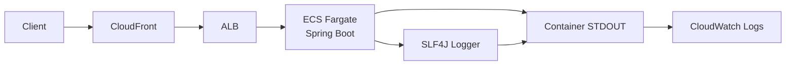

# Spec: 020-app-logging

## 概要
- `backend/` の Spring Boot アプリケーションに、運用・障害調査・業務証跡に使えるアプリケーションログ基盤を追加する。
- 業務コードのログ出力は SLF4J（`log.info/warn/error/debug`）へ統一し、ECS の標準出力経由で CloudWatch Logs に集約する前提を明確化する。
- OTel（分散トレーシング）は本 feature の対象外とする。

## 背景
- 現状の backend は API と例外処理の実装はあるが、業務イベント・異常系・重要状態遷移のログ方針が明文化されていない。
- 既存インフラでは ECS コンテナログが CloudWatch Logs に送られるため、アプリ側ログ設計を整えるだけで運用価値を高められる。
- 障害調査、運用確認、監査対応の観点で「いつ・誰が・何を・結果どうなったか」を追跡できるログが必要である。

## 目的
- 業務イベント、異常系、重要状態遷移を、再現可能かつ検索可能な形式で記録する。
- 開発時のデバッグと本番運用の両方で使えるログレベル運用を定義する。
- 監査用途を想定し、最低限の監査情報（主体・操作・対象・結果）を**アプリケーション監査ログ**として残せる状態にする。

## スコープ
- 変更対象は **主に backend 単一領域**（`backend/src/main`、必要に応じて `backend/src/test`、`backend/README.md`、`docs/backend/`、`backend/AGENTS.md`）。
- 本 feature で扱う範囲:
  - Spring Boot の既存ログ基盤（SLF4J + Logback）を利用したログ出力ルールの定義
  - Controller / Service / ExceptionHandler / Security 周辺へのログ追加方針定義
  - リクエスト単位の相関ID（`requestId`）と AWS 実行時トレースヘッダー（`X-Amzn-Trace-Id`）の扱い定義
  - CloudWatch Logs Insights で検索しやすいログ項目設計（構造化フィールド）
  - 監査ログ・業務ログ・障害調査ログの分類定義
  - `docs/backend/` へのログ設計ドキュメント追加
  - `backend/AGENTS.md` へのログ実装ルール追記

## 対象外
- OTel / X-Ray / 分散トレーシング導入。
- OpenSearch 連携、SIEM 連携、ログ配送パイプライン新設。
- API 契約（エンドポイント、レスポンス構造）の機能変更。
- Aurora PostgreSQL 側のネイティブ監査ログ（`pgaudit` 等）設定変更。
- CloudWatch アラーム/ダッシュボード/通知の新規構築。

## ユーザーストーリー / 利用シナリオ
- バックエンド開発者として、`/api/todos` の作成・更新・削除で何が起きたかを `INFO` ログで追跡したい。
- 運用担当者として、CloudWatch Logs から `requestId` や `traceId` を軸に障害発生時の経路を追いたい。
- セキュリティ/監査担当者として、操作主体（`sub`）・操作種別・対象ID・結果を監査証跡として確認したい。
- 開発者として、詳細調査時のみ `DEBUG` を有効化し、平常時のログ量とコストを抑えたい。

## 機能要件
- FR-01 ログAPI統一
  - 業務コードのログ出力は SLF4J を使用する。
  - `System.out.println` / `printStackTrace` を業務コードで使用しない。

- FR-02 ログカテゴリ定義
  - 以下のカテゴリを定義し、用途を分離する:
    - 業務ログ（例: Todo作成/更新/削除）
    - 監査ログ（誰が、何を、結果どうなったか）
    - 障害調査ログ（例外、外部依存失敗、異常系）
    - デバッグログ（詳細パラメータ・分岐情報）
  - 本 feature で定義する監査ログは、アプリケーション監査ログのみを対象とする（Aurora 側監査ログは対象外）。

- FR-03 ログレベル運用
  - `INFO`: 業務イベント、重要状態遷移、正常系の主要操作結果。
  - `WARN`: リカバリ可能な異常、想定内だが注意が必要な事象（例: 不正入力、存在しない対象への操作）。
  - `ERROR`: 想定外例外、処理失敗、継続困難な異常。
  - `DEBUG`: 調査専用の詳細情報（本番デフォルトは無効）。

- FR-04 出力ポイント（Todo API準拠）
  - `POST /api/todos`: 作成成功/失敗を記録する。
  - `PUT /api/todos/{todoId}`: 更新前後の重要状態遷移（少なくとも completed 変更有無）を記録する。
  - `DELETE /api/todos/{todoId}`: 削除試行と結果を記録する。
  - `GET` 系: 全件詳細は出力せず、取得条件・件数・結果ステータス等の要約を記録する。
  - 監査ログ対象は書き込み操作（`POST`/`PUT`/`DELETE`）とし、読み取り操作（`GET`/`LIST`）は監査ログ対象に含めない。

- FR-05 例外ログ方針
  - 例外ログは境界（例: `ApiExceptionHandler`）で一元記録し、同一例外の多重出力を避ける。
  - `4xx` と `5xx` はログレベルを分離し、原因追跡に必要な最小情報を残す。

- FR-06 相関ID
  - 全リクエストで `requestId` を採番または受領し、同一リクエスト内のログに引き回す。
  - `X-Amzn-Trace-Id` が存在する場合は抽出してログ項目に保持し、相関調査に利用可能にする。

- FR-07 構造化項目
  - CloudWatch Logs Insights で検索しやすいよう、JSON 構造化ログとして以下の主要項目を一貫して出力する:
    - `timestamp`, `level`, `logger`, `message`
    - `requestId`, `traceId`, `path`, `httpMethod`, `httpStatus`
    - `eventType`（BUSINESS/AUDIT/ERROR/DEBUG）
    - `action`（CREATE/UPDATE/DELETE/GET/LIST など）
    - `ownerSubjectHash`（`ownerSubject(sub)` をハッシュ化した値）
    - `todoId`（存在時）

- FR-08 セキュリティ配慮
  - JWT 本文、Authorization ヘッダー、パスワード、Secrets Manager 由来の値、個人情報生値はログ出力しない。
  - エラーログにスタックトレースを出す場合も、機密値を含まないことを保証する。
  - `ownerSubject(sub)` の生値はログ出力せず、ハッシュ化した値のみ出力する。

- FR-09 運用ログ連携前提
  - ログはファイル出力ではなくコンテナ標準出力を正とし、既存 ECS `awslogs` ドライバ連携を利用する。
  - 既存 CloudWatch Logs ロググループで検索可能であること。

- FR-10 ログ設計ドキュメント整備
  - ログ方針・ログレベル・禁止項目・主要検索キー・相関ID方針を `docs/backend/` のログ設計ドキュメントとして追加する。
  - ドキュメントは日本語で記載する。

- FR-11 AGENTS ルール整備
  - `backend/AGENTS.md` にログ実装方針を追記する。
  - 少なくとも以下を明記する:
    - SLF4J 利用方針
    - ログレベル使い分け
    - 機密情報の非出力

- FR-12 本番ログレベル運用
  - 本番ログレベルは環境変数で動的変更可能にする（例: `LOGGING_LEVEL_ROOT`, `LOGGING_LEVEL_<package>`）。
  - デフォルト運用は `INFO` とし、調査時のみ一時的に `DEBUG` を有効化できること。

## 非機能要件
- NFR-01 可観測性
  - CloudWatch Logs Insights で `requestId` / `traceId` / `eventType` / `action` を軸に調査できること。

- NFR-02 性能/コスト
  - 高頻度処理で過剰なログ出力を避け、ログ量増加を抑えること（大量ループ内の冗長 `INFO` 出力禁止）。
  - `DEBUG` は本番常時有効化しない前提とし、必要時のみ環境変数で一時的に有効化する。

- NFR-03 保守性
  - ロガー命名・メッセージ規約・項目名を一貫させ、新規API追加時にも同規約を適用できること。

- NFR-04 信頼性
  - ログ出力失敗が業務処理失敗の主因にならないこと（ログは業務処理の補助機能として扱う）。

- NFR-05 セキュリティ
  - 機密情報の非出力ルールを明文化し、レビューで検証可能であること。

- NFR-06 保持期間
  - 本プロジェクトはサンプルプログラムのため、CloudWatch Logs の保持期間は 1 週間設定を前提とする。
  - 正式運用では、コンプライアンス要件に従った長期保持期間の設定が別途必要であることをドキュメントへ明記する。

## 受け入れ条件
- AC-01 backend の業務コードで SLF4J 利用方針が徹底され、非推奨出力（`System.out.println` 等）が含まれない。
- AC-02 Todo の主要業務イベント（作成・更新・削除）で、`INFO` の業務/監査ログが出力される。
- AC-03 異常系（`4xx`/`5xx`）で `WARN`/`ERROR` の使い分けが実装され、原因調査に必要なキーが記録される。
- AC-04 同一リクエスト内で `requestId` が一貫し、`X-Amzn-Trace-Id` がある場合は相関に利用できる。
- AC-05 機密値がログに出力されないことを、実装レビューまたはテスト観点で確認できる。
- AC-06 `ownerSubject(sub)` の生値がログ出力されず、ハッシュ化値のみが出力される。
- AC-07 `docs/backend/` にログ設計ドキュメントが追加され、開発者/運用者が参照できる。
- AC-08 `backend/AGENTS.md` にログ実装ルールが追記されている。
- AC-09 監査ログ対象が書き込み操作（`POST`/`PUT`/`DELETE`）のみで、`GET`/`LIST` が監査対象外であることが明記されている。
- AC-10 JSON 構造化ログとして主要項目が出力される。
- AC-11 本番ログレベルが環境変数で動的変更可能である。
- AC-12 サンプルとして 1 週間保持、正式運用ではコンプライアンスに応じた長期保持が必要である旨がドキュメントに明記されている。
- AC-13 OTel 導入が本件に含まれていないことが仕様として明記されている。

## 制約
- 既存の Spring Boot ロギング基盤（SLF4J + Logback）と ECS `awslogs` 連携を前提にする。
- 変更は backend 中心とし、インフラ構成変更は本件で必須としない。
- API の公開契約や認証方式（Cognito JWT 検証）は変更しない。
- Aurora 側監査ログ（DB 監査）は本件対象外とし、必要時は別 feature として infra/DB で拡張する。
- 正式運用で監査証跡が必要な場合は、別途コンプライアンス要件に合わせた保持期間・運用設計が必要になる。

## 依存関係
- `backend/src/main/java/com/example/backend/controllers/TodoController.java`
- `backend/src/main/java/com/example/backend/services/impl/TodoServiceImpl.java`
- `backend/src/main/java/com/example/backend/exception/ApiExceptionHandler.java`
- `backend/src/main/java/com/example/backend/security/SecurityConfig.java`
- `backend/src/main/resources/application.properties`
- `backend/AGENTS.md`
- `infra/lib/constructs/todo-backend-ecs-service-construct.ts`（CloudWatch Logs 連携前提）
- `docs/backend/` および `backend/README.md`（運用方針記述）
