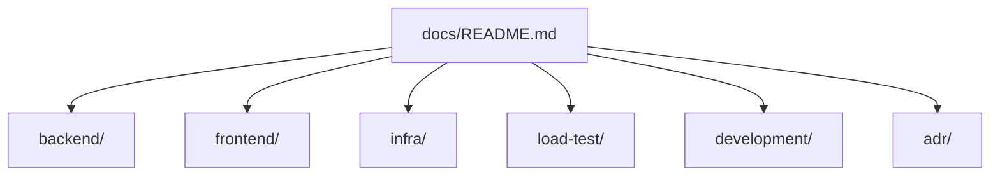

# docs

このディレクトリは、リポジトリ全体の詳細情報を管理するための入口です。  
「何を知りたいか」から、該当ドキュメントへ最短で辿れるように構成しています。

## まずどこを読むか

| 知りたいこと | 参照先 |
| --- | --- |
| AWS へデプロイする手順 | [development/aws-deployment-manual.md](./development/aws-deployment-manual.md) |
| backend のログ設計 | [backend/logging.md](./backend/logging.md) |
| frontend の認証・runtime 設定 | [frontend/README.md](./frontend/README.md) |
| 負荷テスト環境（DLT）デプロイ手順 | [load-test/load-test-deployment.md](./load-test/load-test-deployment.md) |
| 負荷テスト実行手順（Cognito/JWT/K6/DLT） | [load-test/load-test-operations.md](./load-test/load-test-operations.md) |
| DLT シナリオ作成（画面キャプチャ） | [load-test/dlt-new-scenario.md](./load-test/dlt-new-scenario.md) |
| DLT 結果確認（画面キャプチャ） | [load-test/dlt-test-result.md](./load-test/dlt-test-result.md) |
| 設計判断の背景 | [adr/](./adr/) |

## 構成

## ディレクトリ別リンク

### backend
- [backend ドキュメント入口](./backend/README.md)
- 
- 
- 
- [ログ設計](./backend/logging.md)

### frontend
- [frontend ドキュメント入口](./frontend/README.md)

### infra
- 
- 
- 

### development
- [backend 開発手順](./development/backend-development.md)
- [AWS デプロイ手順（Monorepo 全体）](./development/aws-deployment-manual.md)

### load-test
- [負荷テスト環境（DLT）デプロイ手順](./load-test/load-test-deployment.md)
- [負荷テスト実行手順（Cognito/JWT/K6/DLT）](./load-test/load-test-operations.md)
- [DLT コンソールで Scenario 作成・実行（画面キャプチャ）](./load-test/dlt-new-scenario.md)
- [DLT テストシナリオ 実行 結果確認（画面キャプチャ）](./load-test/dlt-test-result.md)

### adr
- [ADR-0001: ECS Fargate 上の Spring Boot アプリにおける Datadog / OpenTelemetry / ログ収集方式](./adr/adr-0001-o11y-datadog-otel-ecs-fargate.md)

## 更新時のルール（要約）

- 入口情報は README に、詳細は各サブディレクトリに配置する。
- 文書を追加したら、この `docs/README.md` から辿れるようにリンクを追加する。
- 仕様変更時は、関連する README と `docs/` の両方を更新対象として確認する。
