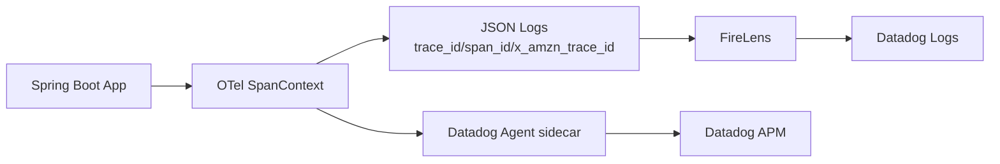

# ADR-0002: OpenTelemetry `trace_id` / `span_id` を正とする Datadog ログ相関方式

- Status: Accepted
- Date: 2026-05-22
- Last Updated: 2026-07-27
- Decision owner: TBD
- Reviewers: TBD
- Supersedes: N/A
- Superseded by: ADR-0004 の Java Agent Logback MDC instrumentation 方針により、`opentelemetry-logback-appender-1.0` 初期化実装は置き換え
- Related specs: `specs/004-Datadog-agent-to-cdk/specs.md`
- Related plan: `specs/004-Datadog-agent-to-cdk/plan.md`
- Related tasks: `specs/004-Datadog-agent-to-cdk/tasks.md`

## 1. 背景

本リポジトリでは、ECS Fargate 上の Spring Boot アプリに OpenTelemetry を導入し、Datadog で `logs / traces / metrics` を横断調査する方針を採用している。  
一方、既存 backend には `RequestLoggingContextFilter` による `X-Amzn-Trace-Id` 由来の `traceId` があり、OpenTelemetry の `trace_id` と意味・形式が異なる。

このままでは、ログ相関キーの命名と意味が混在し、Datadog APM との相関で誤解や実装ぶれが発生する。

## 2. 課題

- ログに出力するトレース相関キーの物理キー名・形式を確定する必要がある。
- `X-Amzn-Trace-Id` 由来キーと OTel `trace_id` の責務を分離する必要がある。
- Datadog 側で `trace_id` / `span_id` を Trace ID / Span ID として確実に認識させる必要がある。
- 同一 Datadog Organization での多アカウント運用に向け、タグ戦略（`service`/`env`/`version` + `team`/`aws_account`/`system`）を整合させる必要がある。

## 3. 決定ドライバー

- Datadog APM と Logs の相関精度
- 実装時の曖昧さ排除（レビュー容易性）
- 既存ログ運用との後方互換性
- OpenTelemetry 標準への整合性

## 4. 決定

### 4.1 採用するもの

- ログ相関の主キーは OpenTelemetry 標準の `trace_id` / `span_id` とする。
- ログのトップレベルに以下を出力する。
  - `trace_id`: `SpanContext.traceId`（32 文字小文字 hex）
  - `span_id`: `SpanContext.spanId`（16 文字小文字 hex）
- Datadog 側で自動認識されない場合は、Preprocessing for JSON logs または Trace ID remapper で `trace_id` を予約 Trace ID にマッピングする。
- `X-Amzn-Trace-Id` は補助情報として扱い、必要な場合のみ `x_amzn_trace_id`（または `aws_trace_id`）で保持する。
- アプリケーション内での相関の正は `Span.current().getSpanContext()` 由来値とする。
- Unified Service Tagging（`service` / `env` / `version`）を logs/traces で一致させる。
- Datadog Agent 側では `DD_SERVICE` / `DD_ENV` / `DD_VERSION` を必須とし、`DD_TAGS` で `team` / `aws_account` / `system` を付与する。
- `DD_SERVICE` / `DD_ENV` / `DD_VERSION` は `DD_TAGS` に重複定義しない。
- `DD_VERSION` / `service.version` は `infra/lib/constructs/backend-image-deployment-construct.ts` の `backendDockerImageAsset.imageTag` を単一ソースとして利用する。

### 4.2 採用しないもの

- Datadog tracer 前提の `dd.trace_id` / `dd.span_id` を主方式にすること。
- `traceId` という曖昧なキー名を新規ログ仕様で使用すること。
- `RequestLoggingContextFilter` で `trace_id` を独自生成・上書きすること。

### 4.3 例外

- `SpanContext` が invalid な場合は `trace_id` / `span_id` を無理に生成しない。
- 既存運用との突合が必要な場合のみ `x_amzn_trace_id` を出力する。

## 5. 最終構成

## 6. 検討した代替案

## 6.1 `traceId`（X-Amzn-Trace-Id 由来）を主相関キーにする

### 内容

既存 `traceId` をそのまま Datadog 相関キーとして利用する。

### メリット

- 既存実装の変更が少ない。

### デメリット

- OTel `trace_id` と形式・意味が異なり、APM 相関の正確性が下がる。
- `traceId` 名称が OTel と混同される。

### 判断

不採用。Datadog APM 相関の主キーとして不適切。

## 6.2 `dd.trace_id` / `dd.span_id` を主方式にする

### 内容

Datadog tracer 由来のキーへ寄せる。

### メリット

- Datadog 既存ドキュメント例と一致するケースがある。

### デメリット

- OpenTelemetry 標準との整合が弱くなる。
- 本プロジェクトの OTel 主体設計とズレる。

### 判断

不採用。OTel 標準キーで統一する。

## 7. 影響

## 7.1 良い影響

- ログ・トレース相関が明確になる。
- 実装・レビュー時の判断基準が統一される。
- Datadog での障害解析導線（Trace ↔ Logs）が安定する。

## 7.2 悪い影響・注意点

- 既存 `traceId` 利用箇所の改修・移行確認が必要。
- Datadog 側の preprocess/remap 設定確認が必要。

## 7.3 リスクと対策

| リスク | 対策 |
|---|---|
| Datadog 側で `trace_id` が予約属性認識されない | Preprocessing または Trace ID remapper を設定し、受入確認で検証する |
| `traceId` と `trace_id` の混在が残る | 新規仕様で `traceId` 使用禁止を明文化し、レビューで検出する |
| 相関キー形式不正 | 32/16 桁小文字 hex を受入条件に追加して検証する |

## 8. 実装方針

- Spring Boot / Logback では OpenTelemetry Java Agent の Logback MDC instrumentation を第一候補として、`trace_id` / `span_id` を JSON へ出力する。
- `RequestLoggingContextFilter` では `trace_id` / `span_id` を独自生成・上書きしない。
- `X-Amzn-Trace-Id` は必要に応じて `x_amzn_trace_id` へ格納する。
- `opentelemetry-logback-appender-1.0` と `OpenTelemetryAppender.install(openTelemetry)` の明示初期化は、Java Agent との二重ログ相関を避けるため削除する。
- backend / infra 側の現行仕様は `docs/infra/o11y.md`、`docs/backend/logging.md`、ADR-0004 を正とし、実装変更時は同時更新する。

## 9. 運用方針

- Logs Explorer で `trace_id` / `span_id` の存在を確認する。
- `trace_id` が 32 文字小文字 hex、`span_id` が 16 文字小文字 hex であることを確認する。
- APM Trace の span から Logs タブへ遷移できることを確認する。
- Logs から Trace（View Trace in APM）へ遷移できることを確認する。
- `service` / `env` / `version` が logs/traces で一致することを確認する。

## 10. コスト方針

- 相関のために必要なキーのみを追加し、不要な高カーディナリティ属性を増やさない。
- 既存ログ量に影響する追加フィールドを最小化する。

## 11. セキュリティ / コンプライアンス方針

- `trace_id` / `span_id` / `x_amzn_trace_id` は識別子として扱い、PII・secret を含めない。
- Authorization ヘッダー全文、トークン本文、個人情報生値は引き続きログ出力禁止とする。

## 12. 採用基準 / 完了条件

- [ ] backend ログに `trace_id` / `span_id` がトップレベルで出力される。
- [ ] `trace_id` が 32 文字小文字 hex、`span_id` が 16 文字小文字 hex である。
- [ ] `traceId` キー名が新規仕様で使われていない。
- [ ] Datadog で Trace ↔ Logs の双方向遷移ができる。
- [ ] `service` / `env` / `version` が logs/traces で一致する。
- [ ] `team` / `aws_account` / `system` が logs/traces/metrics に付与されている。

## 13. ロールバック / 変更方針

- Datadog 相関が成立しない場合は、まず Datadog 側 remap 設定を見直す。
- それでも成立しない場合のみ、例外として `dd.trace_id` / `dd.span_id` 方式の併用を再検討し、本 ADR を更新する。

## 14. 未決事項

- N/A（本 ADR の範囲では方針確定済み）

## 15. 参考資料

- Datadog Correlate OpenTelemetry Traces and Logs: https://docs.datadoghq.com/opentelemetry/correlate/logs_and_traces/
- Datadog Correlating Java Logs and Traces: https://docs.datadoghq.com/tracing/other_telemetry/connect_logs_and_traces/java/?tab=maven
- Datadog Correlated Logs Are Not Showing Up In The Trace ID Panel: https://docs.datadoghq.com/tracing/troubleshooting/correlated-logs-not-showing-up-in-the-trace-id-panel/?tab=jsonlogs
- Datadog Remap Reserved Attributes: https://docs.datadoghq.com/observability_pipelines/guide/remap_reserved_attributes/
- AWS ALB Request Tracing: https://docs.aws.amazon.com/ja_jp/elasticloadbalancing/latest/application/load-balancer-request-tracing.html
- OpenTelemetry Java SDK Configuration: https://opentelemetry.io/docs/languages/java/configuration/
