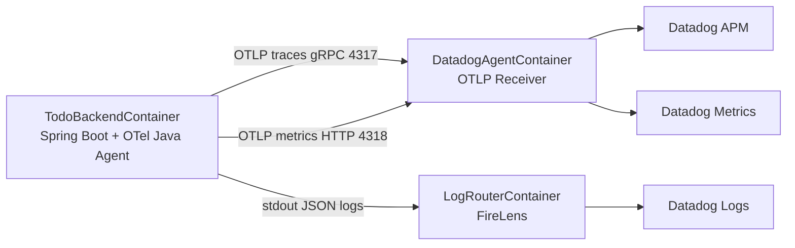

# ADR-0004: APMエージェントの選定（自動計装エージェント）

- Status: Accepted
- Date: 2026-06-04
- Last Updated: 2026-07-27
- Decision owner: TBD
- Reviewers: TBD
- Supersedes: ADR-0003 の Spring Boot OTel starter / Micrometer OTLP Registry を trace / metrics export 主経路とする前提
- Superseded by: N/A
- Related docs: `docs/infra/o11y.md`, `docs/backend/logging.md`, `specs/005-OTel-Java-Agent-conversion/specs.md`, `specs/005-OTel-Java-Agent-conversion/plan.md`, `specs/005-OTel-Java-Agent-conversion/tasks.md`

## 1. コンテキスト

本システムでは APM ツールとして Datadog を採用している。アプリケーションのトレース・メトリクス収集を実現するために、JVM プロセスにアタッチする APM エージェント（自動計装エージェント）の導入を検討した。

候補として以下の 2 つが挙げられた。

- OpenTelemetry Java Agent（`opentelemetry-javaagent.jar`）
- Datadog Java Tracer（`dd-java-agent.jar`）

いずれも `-javaagent` オプションでアプリケーションの起動時にアタッチし、bytecode instrumentation によってコード変更を抑えつつ framework / library のトレース・スパンを自動生成する。

本プロジェクトでは、手動計装だけでは継続対応が難しくなっている以下の要件に対応する必要がある。

- Trace / Span に JDBC instrumentation を追加する。
- Metrics に JDBC instrumentation を追加する。
- Metrics に JVM Runtime Metrics を追加する。
- Java Agent が自動生成しない Trace / Span（業務/手動計装）は、必要な operation に限定して維持する。

## 2. 決定事項

OpenTelemetry Java Agent（`opentelemetry-javaagent.jar`）を採用する。

テレメトリデータの export には OpenTelemetry Protocol（OTLP）を使用し、同一 ECS task 内の Datadog Agent sidecar の OTLP ingest endpoint を経由して Datadog に送信する。

Datadog Java Tracer（`dd-java-agent.jar`）は導入しない。

## 3. 実装上の採用内容

| 項目 | 採用内容 |
| --- | --- |
| OpenTelemetry Java Agent version | `2.30.0` |
| Java Agent 取得方式 | Docker build 時に Maven artifact copy で取得する |
| Java Agent artifact | `io.opentelemetry.javaagent:opentelemetry-javaagent:${OTEL_JAVA_AGENT_VERSION}:jar` |
| Java Agent 配置 | final image の `/app/opentelemetry-javaagent.jar` |
| JVM attach | ECS task definition の `JAVA_TOOL_OPTIONS=-javaagent:/app/opentelemetry-javaagent.jar` |
| Datadog Agent image | `public.ecr.aws/datadog/agent:7.81.2` |
| trace endpoint | `OTEL_EXPORTER_OTLP_TRACES_ENDPOINT=http://localhost:4317` |
| trace protocol | `OTEL_EXPORTER_OTLP_TRACES_PROTOCOL=grpc` |
| metrics endpoint | `OTEL_EXPORTER_OTLP_METRICS_ENDPOINT=http://localhost:4318/v1/metrics` |
| metrics protocol | `OTEL_EXPORTER_OTLP_METRICS_PROTOCOL=http/protobuf` |
| metrics temporality | `OTEL_EXPORTER_OTLP_METRICS_TEMPORALITY_PREFERENCE=delta` |
| logs exporter | `OTEL_LOGS_EXPORTER=none` |
| JDBC semantic conventions | `OTEL_SEMCONV_STABILITY_OPT_IN=database` |
| Micrometer instrumentation | `OTEL_INSTRUMENTATION_MICROMETER_ENABLED=true` |
| Runtime Metrics | `OTEL_INSTRUMENTATION_RUNTIME_TELEMETRY_ENABLED=true` |
| SQL sanitizer | `OTEL_INSTRUMENTATION_COMMON_DB_STATEMENT_SANITIZER_ENABLED=true` |
| health trace 除外 | `DD_APM_IGNORE_RESOURCES=^GET /actuator/health(/.*)?$,^HEAD /actuator/health(/.*)?$` |

Spring Boot OTel starter、Micrometer OTLP Registry、`opentelemetry-logback-appender-1.0` は Java Agent との二重 exporter / 二重ログ相関を避けるため削除する。アプリ内の手動 span は OpenTelemetry API のみに依存し、別 SDK / exporter を起動しない。

## 4. 比較検討

| 比較観点 | OpenTelemetry Java Agent | Datadog Java Tracer |
| --- | --- | --- |
| ベンダー依存性 | CNCF 標準に寄せやすい | Datadog 専用色が強い |
| Datadog 連携 | OTLP ingest 経由で対応 | ネイティブ対応 |
| 計装カバレッジ | Spring / JDBC など主要 framework / library を自動計装 | Datadog 固有機能も含めて広い |
| 設定方法 | `-javaagent` + `OTEL_*` 環境変数 | `-javaagent` + `DD_*` 環境変数 |
| カスタム計装 | OpenTelemetry API を利用できる | Datadog 独自 API 利用時は移行性が下がる |
| 将来の移行性 | exporter / backend 変更で移行しやすい | Datadog 前提の再設計が必要になりやすい |

### OpenTelemetry Java Agent を選択する理由

- OpenTelemetry は CNCF の標準仕様であり、将来的な APM バックエンド変更時の移行性が高い。
- 手動 span に OpenTelemetry API を使えるため、業務コードを Datadog 独自 API に寄せずに済む。
- Datadog Agent は OTLP ingest をサポートしており、現行 ECS sidecar 構成と整合する。
- Spring Web MVC / JDBC / Runtime / Micrometer など、本 feature の主要要件に対応できる。

### Datadog Java Tracer を採用しない理由

- Datadog への依存が強くなり、将来の APM ツール移行コストが高くなる。
- カスタム計装に Datadog 独自 API を用いた場合、アプリケーションコードの修正が必要になりやすい。
- 現時点の要件は OpenTelemetry Java Agent + Datadog Agent OTLP ingest で対応可能と判断する。

## 5. 技術的な考慮事項

### 5.1 アーキテクチャ構成

### 5.2 Trace / Span（業務/手動計装）

Java Agent は framework / library span を自動生成するが、任意の業務メソッドをすべて自動 span 化するものではない。そのため、以下の Todo operation は手動業務 span として限定的に維持する。

| operation | 対象 |
| --- | --- |
| `todo.list` | Todo 一覧取得 |
| `todo.get` | Todo 単件取得 |
| `todo.create` | Todo 作成 |
| `todo.update` | Todo 更新 |
| `todo.delete` | Todo 削除 |

手動業務 span は Java Agent が設定する `GlobalOpenTelemetry` を参照し、同一 trace context 内で HTTP server span と関連付くことを目標とする。attribute は `business.operation`、`result.status` など低カーディナリティ値に限定する。

### 5.3 業務 metrics

`BusinessMetricsService` の `todo.operation.count` / `todo.operation.duration` は Micrometer API のまま維持する。Java Agent の Micrometer instrumentation により Datadog Metrics へ到達することを第一候補とし、prod canary 相当の deploy 後に Datadog Metrics API で到達を確認済みである。

Micrometer instrumentation で期待どおり export できない場合のみ、OpenTelemetry Metrics API への移行を検討する。

### 5.4 ログ相関

アプリログは FireLens 経路を維持し、OTLP logs は使わない。`trace_id` / `span_id` は OpenTelemetry `SpanContext` 由来値を正とし、旧キー `traceId` / `spanId` は JSON ログトップレベルへ復活させない。

初期実装では Datadog Logs pipeline の Preprocessing / Trace ID remapper は追加しない。Java Agent Logback MDC instrumentation だけで相関できない場合のみ、Datadog 側設定または最小補助実装を検討する。

### 5.5 Datadog Agent OTLP ingest version

本実装では Datadog Agent image を `public.ecr.aws/datadog/agent:7.81.2` に pin する。ADR 初版に記載していた `v7.30.0 以上` は古い最低要件の記述であり、Java Agent metrics / runtime metrics / current Datadog OTLP ingest を前提に、実装では検証対象の具体バージョンを固定する。

## 6. 制約・既知の制限事項

- Datadog 固有の高度な機能（Database Monitoring との相関、Continuous Profiler など）は、本 feature の初期対象外とする。
- OpenTelemetry semantic conventions と Datadog のタグ命名規則の差異は、Datadog Agent の OTLP 変換に依存する。カスタム属性の最終表示は canary で確認する。
- Java Agent 導入により app JVM の startup time、CPU、memory、span / metrics 量が増える可能性がある。
- `/actuator/health` 由来 trace は `DD_APM_IGNORE_RESOURCES` で除外するが、Datadog APM 上の resource 名と regex の一致は canary で確認する。
- Datadog UI 上の JDBC metrics、Runtime Metrics、HikariCP metrics の最終 metric 名は実環境確認後に記録する。

## 7. 代替案の再評価トリガー

以下の状況が発生した場合、本決定を再評価する。

- 業務要件上、Datadog Java Tracer のみがサポートする機能が必須となった場合。
- OpenTelemetry Java Agent の Datadog 互換性に重大な問題（データ欠損・不正確な trace / metrics 等）が継続的に発生した場合。
- Datadog から APM ツールを変更する意思決定が行われた場合。
- Java Agent 導入による性能劣化が許容できず、計装範囲の削減では対応できない場合。

## 8. 確認事項

- TODO: `opentelemetry-javaagent.jar` の checksum 検証を Docker build 内で行うか、artifact repository / mirror の検証に委ねるかを決める。
- 確認済み: Docker image 内に `/app/opentelemetry-javaagent.jar` が存在し、非 root 実行ユーザー `spring` から読み取り可能である。
- 確認済み: container 起動時に `JAVA_TOOL_OPTIONS=-javaagent:/app/opentelemetry-javaagent.jar` で OpenTelemetry Java Agent `2.30.0` が attach される。
- 確認済み: prod canary 相当の deploy 後、Java Agent Logback MDC instrumentation により Datadog Logs で `trace_id` / `span_id` が確認できる。
- 確認済み: prod canary 相当の deploy 後、`todo.operation.*` は Java Agent Micrometer instrumentation 経由で Datadog Metrics に到達する。
- 確認済み: JDBC metrics / Runtime Metrics / HikariCP metrics は Datadog Metrics API で確認できる。
- 確認済み: prod canary 相当の deploy 後、ECS task は steady state に到達し、OOM kill / restart / essential container stop は発生していない。

## 9. 参考情報

- OpenTelemetry Java Agent
  https://opentelemetry.io/docs/zero-code/java/agent/
- OpenTelemetry Java Agent Configuration
  https://opentelemetry.io/docs/zero-code/java/agent/configuration/
- OpenTelemetry Java Agent Supported Libraries
  https://opentelemetry.io/docs/zero-code/java/agent/supported-libraries/
- Datadog Agent OTLP Ingestion
  https://docs.datadoghq.com/opentelemetry/setup/otlp_ingest_in_the_agent/
- Datadog OpenTelemetry Runtime Metrics
  https://docs.datadoghq.com/opentelemetry/integrations/runtime_metrics/?tab=java
