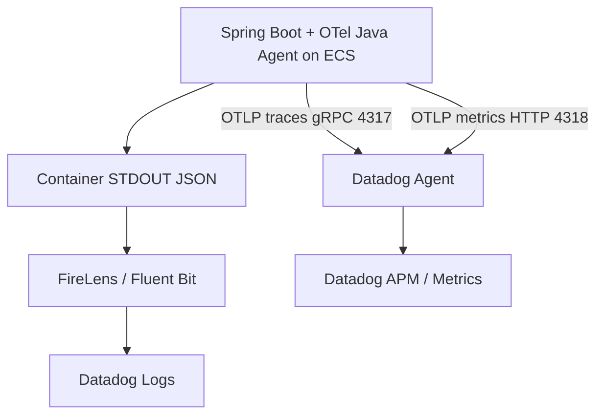

# Backend ログ設計

## この文書の目的

- `backend/` のアプリケーションログ実装方針を、開発者・運用者が同じ前提で参照できるようにする。
- AWS 実行環境（ECS -> FireLens -> Datadog Logs）で調査可能なログキーと運用ルールを明確化する。
- OpenTelemetry Java Agent 導入後も `trace_id` / `span_id` を主相関キーとして維持する。

## ログ分類

- 業務ログ（`eventType=BUSINESS`）
  - 正常系の重要イベント、状態遷移、検索結果要約を記録する。
- 監査ログ（`eventType=AUDIT`）
  - 書き込み操作（`POST`/`PUT`/`DELETE`）の主体・対象・結果を記録する。
- 異常系ログ（`eventType=ERROR`）
  - 4xx は `WARN`、未処理例外（5xx）は `ERROR` で記録する。
- デバッグログ（`eventType=DEBUG`）
  - 正規化結果や分岐確認など、調査用途の詳細情報を記録する。

## トレース計装方針（本サンプル固有）

- HTTP server / Servlet / Spring Web MVC / JDBC などの framework / library span は OpenTelemetry Java Agent の自動計装を主経路とする。
- Java Agent は任意の業務メソッドをすべて自動 span 化しない。
- 業務処理単位の span は `TodoOperationTelemetryAspect` により `TodoServiceImpl` の Todo 操作だけに限定する。
- 旧 `PublicMethodTelemetryAspect` のように Spring 管理 Bean の全 public method を span 化する方式は採用しない。

| 対象メソッド | operation |
| --- | --- |
| `TodoServiceImpl.listTodos` | `todo.list` |
| `TodoServiceImpl.getTodo` | `todo.get` |
| `TodoServiceImpl.createTodo` | `todo.create` |
| `TodoServiceImpl.updateTodo` | `todo.update` |
| `TodoServiceImpl.deleteTodo` | `todo.delete` |

手動業務 span の attribute は `business.operation`、`result.status` など低カーディナリティ値に限定する。JWT、Authorization header、Cookie、DB 接続情報、SQL bind parameter、PII 生値は span attribute に含めない。

## 監査対象範囲

- 監査ログ対象:
  - `POST /api/todos`
  - `PUT /api/todos/{todoId}`
  - `DELETE /api/todos/{todoId}`
- 監査ログ対象外:
  - 読み取り操作（`GET`/`LIST`）

補足:

- 本 feature で扱う監査はアプリケーション監査ログのみ。
- Aurora 側監査ログ（`pgaudit` などの DB 監査）は対象外。

## JSON フィールド定義

Datadog Logs で検索しやすいよう、ログは JSON 構造化形式を前提とする。

主要フィールド:

- `timestamp`
- `level`
- `logger`
- `message`
- `service`
- `env`
- `version`
- `requestId`
- `trace_id`
- `span_id`
- `x_amzn_trace_id`
- `path`
- `httpMethod`
- `httpStatus`
- `eventType`
- `action`
- `ownerSubjectHash`
- `todoId`（対象がある場合）

## 相関 ID 方針

- `requestId`
  - `X-Request-Id` が来ていれば利用し、未指定時はサーバー側で採番する。
- `trace_id` / `span_id`
  - OpenTelemetry の `SpanContext` 由来値を正とし、Datadog APM 相関の主キーとして利用する。
  - 第一候補は OpenTelemetry Java Agent の Logback MDC instrumentation による MDC 注入とする。
  - `trace_id` は 32 文字小文字 hex、`span_id` は 16 文字小文字 hex を使用する。
  - `TodoOperationTelemetryAspect` は有効な `SpanContext` がある場合だけ `trace_id` / `span_id` を MDC に反映し、処理後に既存 MDC 値を復元する。
- `x_amzn_trace_id`
  - `X-Amzn-Trace-Id` の `Root=` 値を補助情報として保持し、AWS 側ログとの突合に利用する。
  - `trace_id` を上書きしない。
- `traceId` / `spanId`
  - 旧キーとして扱い、JSON ログトップレベルへ復活させない。

`RequestLoggingContextFilter` は `requestId`、`path`、`httpMethod`、`x_amzn_trace_id` のリクエスト補助情報を MDC に設定する。`trace_id` / `span_id` は独自生成または上書きしない。

構造化ログでは MDC と `addKeyValue` に同じキーを重複させると JSON 出力時に例外となる可能性がある。そのため、`path`、`httpMethod`、`x_amzn_trace_id` など MDC に存在するキーを同一イベントで再度 `addKeyValue` しない。

## Datadog Logs pipeline 方針

初期実装では Datadog Logs pipeline の Preprocessing / Trace ID remapper は追加しない。

理由:

- ADR-0002 の方針どおり、アプリ側ログでは OpenTelemetry 形式の `trace_id` / `span_id` を正とする。
- Java Agent Logback MDC instrumentation により Datadog が標準的に相関できる形を第一候補にする。
- Datadog 側設定不足を理由に、アプリ側キーを `dd.trace_id` / `dd.span_id` へ安易に変更しない。

Datadog 上で Logs -> Trace / Trace -> Logs の双方向遷移が成立しない場合のみ、Datadog Logs pipeline 側の追加設定を検討する。

## 主体識別子（ownerSubject）の扱い

- JWT `sub` の生値（`ownerSubject`）はログ出力しない。
- ログには `ownerSubjectHash`（SHA-256）を出力する。
- これにより、主体の生値露出を避けつつ同一主体の相関調査を可能にする。

## ログレベル運用

- 既定レベル: `INFO`
- 主要運用:
  - `WARN`: クライアント修正可能な 4xx 異常
  - `ERROR`: 未処理例外などの 5xx 異常
  - `DEBUG`: 調査時のみ一時的に有効化
- 動的変更:
  - `LOGGING_LEVEL_ROOT`
  - `LOGGING_LEVEL_COM_EXAMPLE_BACKEND`

Java Agent debug logging は本番で常時有効にしない。

## 機密情報の非出力ルール

以下はログへ出力しない:

- JWT 本文
- Authorization ヘッダー
- Cookie
- Secrets Manager 由来の接続情報
- SQL bind parameter
- 個人情報の生値
- `ownerSubject(sub)` の生値

## AWS 運用前提

- backend はコンテナ標準出力へログ出力する。
- ログ相関の主調査画面は Datadog（Logs/APM）とする。
- CloudWatch Logs は sidecar（`log_router` / `datadog-agent`）の診断用途・短期保持用途に限定する。
- OTLP logs は使わない。

## 保持期間ポリシー

- Datadog Logs の保持期間、Index、Exclusion Filter は infra/Datadog 運用設計に従う。
- CloudWatch Logs の保持期間は診断ログ用途に限定し、環境別保持日数は `docs/infra/o11y.md` の方針（`dev=3日, stg=7日, prod=14日`）に従う。

## 確認事項 / TODO

- 確認済み: prod canary 相当の deploy 後、Java Agent Logback MDC instrumentation だけで Datadog Logs に `trace_id` / `span_id` が出る。
- 確認済み: `trace_id` は 32 文字小文字 hex、`span_id` は 16 文字小文字 hex として Datadog Logs に取り込まれる。
- 確認済み: `traceId` / `spanId` の旧キーは Datadog Logs の sample では復活していない。
- 確認済み: Datadog API 上では同一 `trace_id` の Logs / Spans を相互検索できるため、初期実装では Logs pipeline の Preprocessing / Trace ID remapper を追加しない。
- 確認事項: ブラウザ UI 上の Trace から Logs / Logs から Trace へのクリック遷移は、必要に応じて運用確認で実施する。

## 関連

- [backend 入口 README](../../backend/README.md)
- [backend ドキュメント入口](./README.md)
- [infra 入口 README](../../infra/README.md)
- [Observability 仕様](../infra/o11y.md)
- [ADR-0002: OpenTelemetry `trace_id` / `span_id` を正とする Datadog ログ相関方式](../adr/adr-0002-trace-correlation-otel-datadog.md)
- [ADR-0004: APMエージェントの選定](../adr/adr-0004-OTel-Java-Agent.md)
