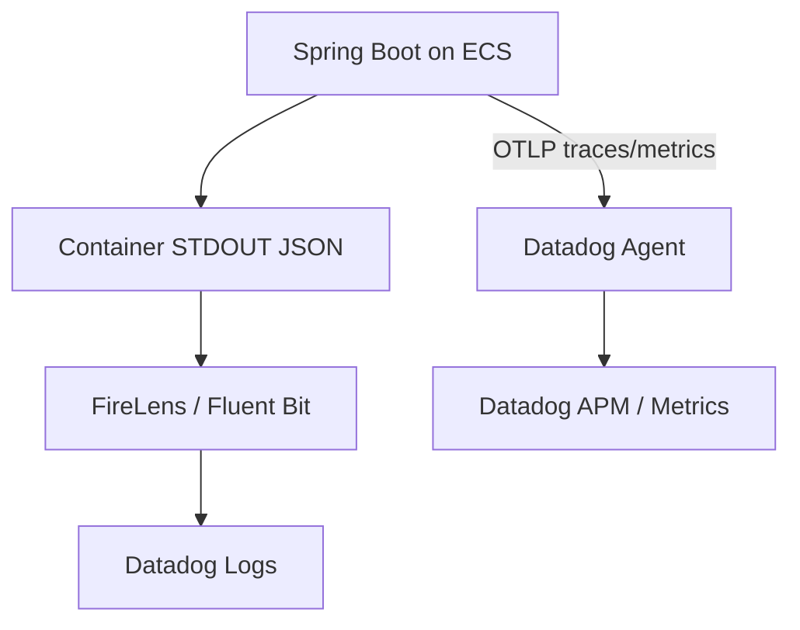

# Backend ログ設計

## この文書の目的

- `backend/` のアプリケーションログ実装方針を、開発者・運用者が同じ前提で参照できるようにする。
- AWS 実行環境（ECS -> FireLens -> Datadog Logs）で調査可能なログキーと運用ルールを明確化する。

## ログ分類

- 業務ログ（`eventType=BUSINESS`）
  - 正常系の重要イベント、状態遷移、検索結果要約を記録する。
- 監査ログ（`eventType=AUDIT`）
  - 書き込み操作（`POST`/`PUT`/`DELETE`）の主体・対象・結果を記録する。
- 異常系ログ（`eventType=ERROR`）
  - 4xx は `WARN`、未処理例外（5xx）は `ERROR` で記録する。
- デバッグログ（`eventType=DEBUG`）
  - 正規化結果や分岐確認など、調査用途の詳細情報を記録する。

## トレース計装方針（本サンプル固有）

- 本リポジトリの Todo アプリはサンプルでメソッド数が少ないため、Spring 管理 Bean の `public` メソッドを対象に Tracer API 併用で span を付与する。
- `private` メソッド、DTO/Entity の accessor、Repository static helper は対象外とする。

## 監査対象範囲

- 監査ログ対象:
  - `POST /api/todos`
  - `PUT /api/todos/{todoId}`
  - `DELETE /api/todos/{todoId}`
- 監査ログ対象外:
  - 読み取り操作（`GET`/`LIST`）

補足:
- 本 feature で扱う監査は **アプリケーション監査ログ** のみ。
- Aurora 側監査ログ（`pgaudit` などの DB 監査）は対象外。

## JSON フィールド定義

Datadog Logs で検索しやすいよう、ログは JSON 構造化形式を前提とする。

主要フィールド:

- `timestamp`
- `level`
- `logger`
- `message`
- `service`
- `env`
- `version`
- `requestId`
- `trace_id`
- `span_id`
- `x_amzn_trace_id`
- `path`
- `httpMethod`
- `httpStatus`
- `eventType`
- `action`
- `ownerSubjectHash`
- `todoId`（対象がある場合）

## 相関 ID 方針

- `requestId`
  - `X-Request-Id` が来ていれば利用し、未指定時はサーバー側で採番する。
- `trace_id` / `span_id`
  - OpenTelemetry の `Span.current().getSpanContext()` を正とし、Datadog APM 相関の主キーとして利用する。
  - `trace_id` は 32 文字小文字 hex、`span_id` は 16 文字小文字 hex を使用する。
- `x_amzn_trace_id`
  - `X-Amzn-Trace-Id` の `Root=` 値を補助情報として保持し、AWS 側ログとの突合に利用する。
  - `traceId` というキー名は新規仕様で使用しない。
- 実装では MDC をリクエスト単位で設定し、終了時にクリアする。

## 主体識別子（ownerSubject）の扱い

- JWT `sub` の生値（`ownerSubject`）はログ出力しない。
- ログには `ownerSubjectHash`（SHA-256）を出力する。
- これにより、主体の生値露出を避けつつ同一主体の相関調査を可能にする。

## ログレベル運用

- 既定レベル: `INFO`
- 主要運用:
  - `WARN`: クライアント修正可能な 4xx 異常
  - `ERROR`: 未処理例外などの 5xx 異常
  - `DEBUG`: 調査時のみ一時的に有効化
- 動的変更:
  - `LOGGING_LEVEL_ROOT`
  - `LOGGING_LEVEL_COM_EXAMPLE_BACKEND`

## 機密情報の非出力ルール

以下はログへ出力しない:

- JWT 本文
- Authorization ヘッダー
- Secrets Manager 由来の接続情報
- 個人情報の生値
- `ownerSubject(sub)` の生値

## AWS 運用前提

- backend はコンテナ標準出力へログ出力する。
- ログ相関の主調査画面は Datadog（Logs/APM）とする。
- CloudWatch Logs は sidecar（`log_router` / `datadog-agent`）の診断用途・短期保持用途に限定する。

## 保持期間ポリシー

- Datadog Logs の保持期間、Index、Exclusion Filter は infra/Datadog 運用設計に従う。
- CloudWatch Logs の保持期間は診断ログ用途に限定し、環境別保持日数は `docs/infra/o11y.md` の方針（`dev=3日, stg=7日, prod=14日`）に従う。

## 関連

- [backend 入口 README](../../backend/README.md)
- [backend ドキュメント入口](./README.md)
- [infra 入口 README](../../infra/README.md)
