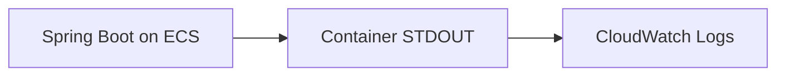

# Backend ログ設計

## この文書の目的

- `backend/` のアプリケーションログ実装方針を、開発者・運用者が同じ前提で参照できるようにする。
- AWS 実行環境（ECS -> CloudWatch Logs）で調査可能なログキーと運用ルールを明確化する。

## ログ分類

- 業務ログ（`eventType=BUSINESS`）
  - 正常系の重要イベント、状態遷移、検索結果要約を記録する。
- 監査ログ（`eventType=AUDIT`）
  - 書き込み操作（`POST`/`PUT`/`DELETE`）の主体・対象・結果を記録する。
- 異常系ログ（`eventType=ERROR`）
  - 4xx は `WARN`、未処理例外（5xx）は `ERROR` で記録する。
- デバッグログ（`eventType=DEBUG`）
  - 正規化結果や分岐確認など、調査用途の詳細情報を記録する。

## 監査対象範囲

- 監査ログ対象:
  - `POST /api/todos`
  - `PUT /api/todos/{todoId}`
  - `DELETE /api/todos/{todoId}`
- 監査ログ対象外:
  - 読み取り操作（`GET`/`LIST`）

補足:
- 本 feature で扱う監査は **アプリケーション監査ログ** のみ。
- Aurora 側監査ログ（`pgaudit` などの DB 監査）は対象外。

## JSON フィールド定義

CloudWatch Logs Insights で検索しやすいよう、ログは JSON 構造化形式を前提とする。

主要フィールド:

- `timestamp`
- `level`
- `logger`
- `message`
- `requestId`
- `traceId`
- `path`
- `httpMethod`
- `httpStatus`
- `eventType`
- `action`
- `ownerSubjectHash`
- `todoId`（対象がある場合）

## 相関 ID 方針

- `requestId`
  - `X-Request-Id` が来ていれば利用し、未指定時はサーバー側で採番する。
- `traceId`
  - `X-Amzn-Trace-Id` がある場合は `Root=` の値を抽出して利用する。
- 実装は `OncePerRequestFilter` で MDC に設定し、リクエスト終了時にクリアする。

## 主体識別子（ownerSubject）の扱い

- JWT `sub` の生値（`ownerSubject`）はログ出力しない。
- ログには `ownerSubjectHash`（SHA-256）を出力する。
- これにより、主体の生値露出を避けつつ同一主体の相関調査を可能にする。

## ログレベル運用

- 既定レベル: `INFO`
- 主要運用:
  - `WARN`: クライアント修正可能な 4xx 異常
  - `ERROR`: 未処理例外などの 5xx 異常
  - `DEBUG`: 調査時のみ一時的に有効化
- 動的変更:
  - `LOGGING_LEVEL_ROOT`
  - `LOGGING_LEVEL_COM_EXAMPLE_BACKEND`

## 機密情報の非出力ルール

以下はログへ出力しない:

- JWT 本文
- Authorization ヘッダー
- Secrets Manager 由来の接続情報
- 個人情報の生値
- `ownerSubject(sub)` の生値

## AWS 運用前提

- backend はコンテナ標準出力へログ出力する。
- ECS タスク定義の `awslogs` ドライバで CloudWatch Logs へ集約する。

## 保持期間ポリシー

- 本プロジェクト（サンプル）では、CloudWatch Logs の保持期間を **1 週間** 前提とする。
- 正式運用では、監査要件・コンプライアンス要件に従った **長期保持期間** を別途設定する必要がある。

## 関連

- [backend 入口 README](../../backend/README.md)
- [backend ドキュメント入口](./README.md)
- [infra 入口 README](../../infra/README.md)
