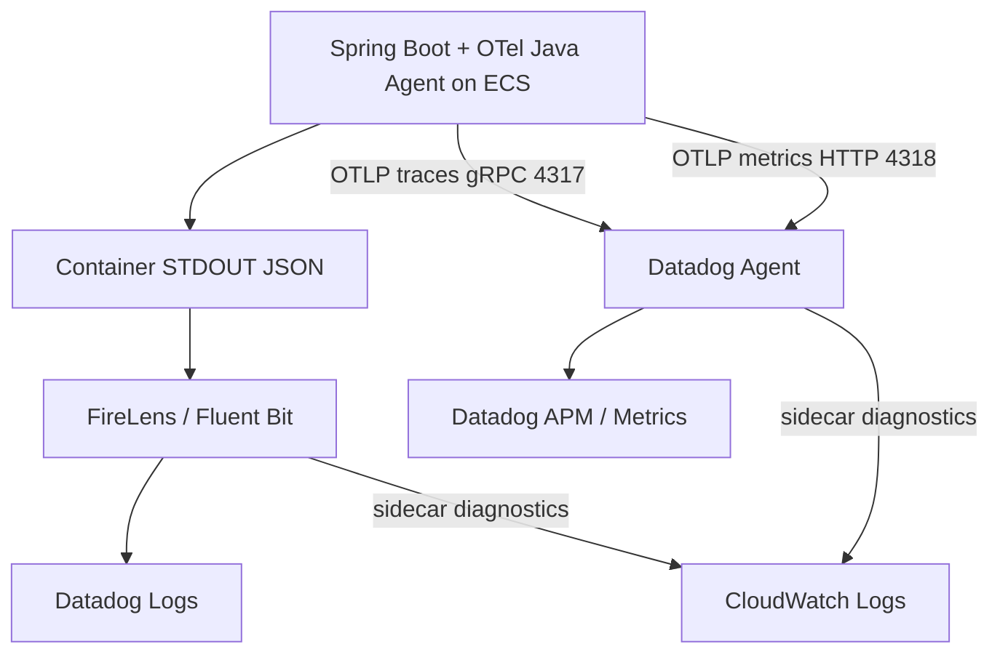

# Backend ログ / 手動業務テレメトリ設計

## この文書の目的

- `backend/` のアプリケーションログ実装方針を、開発者・運用者が同じ前提で参照できるようにする。
- AWS 実行環境（ECS -> FireLens -> Datadog Logs）で調査可能なログキーと運用ルールを明確化する。
- OpenTelemetry Java Agent 導入後も `trace_id` / `span_id` を主相関キーとして維持する。
- `src/main/java/com/example/backend/logging` と `src/main/java/com/example/backend/telemetry` の責務を明確にし、自動計装と手動計装の境界を誤解しないようにする。

## ログとテレメトリの役割分担

この backend では、ログ出力、trace/span、metrics を次のように分けている。理由は、調査で見る情報の粒度と使い方がそれぞれ違うためである。

- ログ出力は、特定のリクエストや業務イベントで「何が起きたか」を人間が読むために使う。
- trace/span は、1つのリクエストが HTTP、Service、JDBC などをどう通ったかを追うために使う。
- metrics は、成功/失敗件数、処理時間、JVM 状態などを集計し、傾向や異常を検知するために使う。

この違いを曖昧にすると、ログへ不要な集計情報を詰め込んだり、metrics に高カーディナリティな値を入れたり、Java Agent の自動計装とアプリ側の手動計装を重複させたりしやすい。そのため、役割を分けて記載する。

- ログ出力: アプリコードが SLF4J で出力し、Spring Boot が JSON 化する。
- 自動計装: OpenTelemetry Java Agent が HTTP / Spring / JDBC / Runtime / Micrometer などを取得する。
- 手動計装: `src/main/java/com/example/backend/telemetry` が Todo 業務操作の span と metrics だけを補う。

| 対象 | 自動計装/手動計装/ログ出力 | 実装・設定 | Datadog への経路 | データの作り方 |
| --- | --- | --- | --- | --- |
| アプリログ | ログ出力 | `logging`、`TodoController`、`TodoServiceImpl`、`application.properties` | stdout -> FireLens -> Datadog Logs | SLF4J で出力し、Spring Boot 構造化ログで JSON 化する |
| HTTP / Spring / JDBC の trace/span | 自動計装 | `Dockerfile` で Java Agent を同梱し、ECS task definition の `JAVA_TOOL_OPTIONS` / `OTEL_*` で有効化する | OTLP/gRPC 4317 -> Datadog Agent -> Datadog APM | OpenTelemetry Java Agent が framework / library 呼び出しから span を作る |
| Todo 業務 span | 手動計装 | `telemetry/TodoOperationTelemetryAspect.java`、`telemetry/TodoOperationSpanService.java` | OTLP/gRPC 4317 -> Datadog Agent -> Datadog APM | AOP で Todo 操作を囲み、OpenTelemetry API で span を作る |
| JDBC / Runtime metrics | 自動計装 | OpenTelemetry Java Agent | OTLP/HTTP 4318 -> Datadog Agent -> Datadog Metrics | OpenTelemetry Java Agent が JVM / JDBC などから metrics を作る |
| Todo 業務 metrics | 手動計装 | `telemetry/BusinessMetricsService.java` | Micrometer -> Java Agent -> OTLP/HTTP 4318 -> Datadog Agent -> Datadog Metrics | アプリコードが Micrometer API に明示的に記録する |

## ログ出力の分類

この分類は、アプリケーションが SLF4J で出力するログの分類である。

ログには `eventType` を付け、Datadog Logs で「業務イベント」「監査証跡」「異常」「詳細調査」を分けて検索できるようにする。分類を分ける理由は、通常運用で見るログ、監査で残すログ、障害時に優先して見るログ、必要な時だけ増やすログを混同しないためである。

| 分類 | `eventType` | 主な用途 | 出力例 |
| --- | --- | --- | --- |
| 業務ログ | `BUSINESS` | 正常系の重要イベント、状態遷移、検索結果要約を確認する | Todo 一覧取得、Todo 永続化、完了状態の変更 |
| 監査ログ | `AUDIT` | 書き込み操作の主体・対象・結果を証跡として残す | `POST` / `PUT` / `DELETE` の成功 |
| 異常系ログ | `ERROR` | 入力異常や未処理例外を調査する | 4xx の警告、5xx の例外 |
| デバッグログ | `DEBUG` | 調査時だけ詳細な分岐や正規化結果を確認する | page / size / sort の正規化結果 |

ログレベルは分類と完全には一致しない。例えば `eventType=ERROR` のうち、クライアント修正可能な 4xx は `WARN`、未処理例外などの 5xx は `ERROR` として出力する。

## 実装の中心

`logging` パッケージはログ文脈と主体識別子の安全な表現を担当する。`telemetry` パッケージは Todo 業務操作の手動 span と業務 metrics を担当する。自動計装は OpenTelemetry Java Agent と infra 側の設定で扱う。

| ファイル | 主な責務 | 保守時の注意 |
| --- | --- | --- |
| `logging/RequestLoggingContextFilter.java` | リクエスト開始時に `requestId`、`path`、`httpMethod`、`x_amzn_trace_id` を MDC に入れる。未処理例外は `eventType=ERROR` として記録し、最後に `MDC.clear()` する。 | `trace_id` / `span_id` は独自生成しない。OpenTelemetry Java Agent または `TodoOperationSpanService` 由来値を壊さない。 |
| `logging/OwnerSubjectHashService.java` | JWT `sub` などの主体識別子を SHA-256 hash に変換し、ログには `ownerSubjectHash` だけを出す。 | 生の `ownerSubject` はログへ出さない。空値は `anonymous`、hash 不能時は `hash-unavailable` に寄せる。 |
| `telemetry/OpenTelemetryApiConfig.java` | Java Agent が設定する `GlobalOpenTelemetry` を Spring Bean として公開し、手動 span が同じ OpenTelemetry 基盤を参照できるようにする。 | アプリ内で別の OpenTelemetry SDK / exporter を起動しない。 |
| `telemetry/TodoOperationTelemetryAspect.java` | `TodoServiceImpl` の Todo 操作だけを AOP で囲み、手動業務 span と `todo.operation.*` metrics を記録する入口になる。 | 旧 `PublicMethodTelemetryAspect` のような全 public method 計装へ戻さない。対象 operation は低カーディナリティ固定値に限定する。 |
| `telemetry/TodoOperationSpanService.java` | OpenTelemetry API で手動業務 span を作成し、成功/失敗 status と低カーディナリティ attribute を付与する。必要な場合だけ `trace_id` / `span_id` を MDC に反映し、終了時に復元する。 | MDC の外側値を必ず復元する。`SpanContext` が invalid な場合は相関 ID を作らない。 |
| `telemetry/BusinessMetricsService.java` | Micrometer `MeterRegistry` に `todo.operation.count` と `todo.operation.duration` を手動記録する。 | Datadog への export は Java Agent Micrometer instrumentation に任せる。アプリ側で OTel Metrics API と二重実装しない。 |
| `telemetry/TelemetryEnvironmentValidator.java` | `DD_ENV` を `dev` / `stg` / `prod` に制限し、タグ不整合を起動時に検知する。 | 新しい環境名を追加する場合は infra の環境定義と同時に更新する。 |

## 構造化ログ設定

`src/main/resources/application.properties` で Spring Boot の構造化 JSON ログを有効にしている。

| 設定 | 役割 |
| --- | --- |
| `logging.structured.format.console=${LOGGING_STRUCTURED_FORMAT_CONSOLE:logstash}` | コンソール出力を JSON へ統一し、ECS stdout から FireLens へ渡せる形にする。 |
| `logging.structured.json.add.service=${DD_SERVICE:${spring.application.name}}` | Datadog Unified Service Tagging の `service` をログへ付与する。 |
| `logging.structured.json.add.env=${DD_ENV:dev}` | Datadog Unified Service Tagging の `env` をログへ付与する。 |
| `logging.structured.json.add.version=${DD_VERSION:unknown-version}` | Datadog Unified Service Tagging の `version` をログへ付与する。 |
| `logging.structured.json.exclude=traceId,spanId` | 旧 camelCase キーを JSON トップレベルへ復活させない。 |
| `spring.aop.proxy-target-class=true` | `TodoServiceImpl` に限定した業務 span / metrics AOP を実装クラスへ確実に適用する。 |

ログレベルは `LOGGING_LEVEL_ROOT` と `LOGGING_LEVEL_COM_EXAMPLE_BACKEND` で変更できる。Datadog 取り込み量に直結するため、`DEBUG` は調査時だけ一時的に使う。

## ログイベント出力箇所

| 実装箇所 | 主なイベント |
| --- | --- |
| `TodoController` | API レスポンス契約に近い業務ログと監査ログを出す。`LIST` / `GET` は `BUSINESS`、`CREATE` / `UPDATE` / `DELETE` は `AUDIT`。 |
| `TodoServiceImpl` | 永続化後の業務イベント、状態遷移、検索条件正規化の `DEBUG` を出す。 |
| `RequestLoggingContextFilter` | AWS ALB 由来の `X-Amzn-Trace-Id` 補助文脈と未処理例外を出す。 |

Controller と Service の両方にログがあるのは、HTTP 契約に近い監査証跡と、永続化・状態遷移に近い業務イベントを分けるためである。どちらにも JWT `sub` 生値やリクエスト本文全文は出さない。

## Trace / Span 計装方針

- HTTP server / Servlet / Spring Web MVC / JDBC などの framework / library span は OpenTelemetry Java Agent の自動計装を主経路とする。
- 自動計装は `src/main/java/com/example/backend/telemetry` では実装しない。`Dockerfile` で Java Agent を image に同梱し、infra 側 ECS task definition の `JAVA_TOOL_OPTIONS` と `OTEL_*` 環境変数で有効化する。
- Java Agent は任意の業務メソッドをすべて自動 span 化しない。
- 業務処理単位の手動 span は `TodoOperationTelemetryAspect` により `TodoServiceImpl` の Todo 操作だけに限定する。
- 旧 `PublicMethodTelemetryAspect` のように Spring 管理 Bean の全 public method を span 化する方式は採用しない。

| 対象メソッド | operation |
| --- | --- |
| `TodoServiceImpl.listTodos` | `todo.list` |
| `TodoServiceImpl.getTodo` | `todo.get` |
| `TodoServiceImpl.createTodo` | `todo.create` |
| `TodoServiceImpl.updateTodo` | `todo.update` |
| `TodoServiceImpl.deleteTodo` | `todo.delete` |

手動業務 span の attribute は `business.operation`、`result.status` など低カーディナリティ値に限定する。JWT、Authorization header、Cookie、DB 接続情報、SQL bind parameter、PII 生値は span attribute に含めない。

## Metrics 計装方針

- JDBC / HikariCP / JVM Runtime などの metrics は OpenTelemetry Java Agent の自動計装で取得する。
- `src/main/java/com/example/backend/telemetry` は、これらの自動 metrics を実装しない。
- `BusinessMetricsService` は Todo 業務操作の件数と処理時間だけを Micrometer API で手動記録する。
- `todo.operation.count` と `todo.operation.duration` の Datadog 送信は、Java Agent の Micrometer instrumentation に任せる。
- アプリ内で OpenTelemetry Metrics API と Micrometer API を二重運用しない。

| metric | 記録元 | 主なタグ | 用途 |
| --- | --- | --- | --- |
| `todo.operation.count` | `BusinessMetricsService` | `service`、`env`、`operation`、`result` | Todo 操作の成功/失敗件数を集計する |
| `todo.operation.duration` | `BusinessMetricsService` | `service`、`env`、`operation`、`result` | Todo 操作の処理時間分布を ms 単位で確認する |

## 監査対象範囲

- 監査ログ対象:
  - `POST /api/todos`
  - `PUT /api/todos/{todoId}`
  - `DELETE /api/todos/{todoId}`
- 監査ログ対象外:
  - 読み取り操作（`GET`/`LIST`）

補足:

- 本 feature で扱う監査はアプリケーション監査ログのみ。
- Aurora 側監査ログ（`pgaudit` などの DB 監査）は対象外。

## JSON フィールド定義

Datadog Logs で検索しやすいよう、ログは JSON 構造化形式を前提とする。

主要フィールド:

- `timestamp`
- `level`
- `logger`
- `message`
- `service`
- `env`
- `version`
- `requestId`
- `trace_id`
- `span_id`
- `x_amzn_trace_id`
- `path`
- `httpMethod`
- `httpStatus`
- `eventType`
- `action`
- `ownerSubjectHash`
- `todoId`（対象がある場合）

## 相関 ID 方針

- `requestId`
  - `X-Request-Id` が来ていれば利用し、未指定時はサーバー側で採番する。
- `trace_id` / `span_id`
  - OpenTelemetry の `SpanContext` 由来値を正とし、Datadog APM 相関の主キーとして利用する。
  - 第一候補は OpenTelemetry Java Agent の Logback MDC instrumentation による MDC 注入とする。
  - `trace_id` は 32 文字小文字 hex、`span_id` は 16 文字小文字 hex を使用する。
  - `TodoOperationSpanService` は有効な `SpanContext` がある場合だけ `trace_id` / `span_id` を MDC に反映し、処理後に既存 MDC 値を復元する。
- `x_amzn_trace_id`
  - `X-Amzn-Trace-Id` の `Root=` 値を補助情報として保持し、AWS 側ログとの突合に利用する。
  - `trace_id` を上書きしない。
- `traceId` / `spanId`
  - 旧キーとして扱い、JSON ログトップレベルへ復活させない。

`RequestLoggingContextFilter` は `requestId`、`path`、`httpMethod`、`x_amzn_trace_id` のリクエスト補助情報を MDC に設定する。`trace_id` / `span_id` は独自生成または上書きしない。

構造化ログでは MDC と `addKeyValue` に同じキーを重複させると JSON 出力時に例外となる可能性がある。そのため、`path`、`httpMethod`、`x_amzn_trace_id` など MDC に存在するキーを同一イベントで再度 `addKeyValue` しない。

## Datadog Logs pipeline 方針

初期実装では Datadog Logs pipeline の Preprocessing / Trace ID remapper は追加しない。

理由:

- ADR-0002 の方針どおり、アプリ側ログでは OpenTelemetry 形式の `trace_id` / `span_id` を正とする。
- Java Agent Logback MDC instrumentation により Datadog が標準的に相関できる形を第一候補にする。
- Datadog 側設定不足を理由に、アプリ側キーを `dd.trace_id` / `dd.span_id` へ安易に変更しない。

Datadog 上で Logs -> Trace / Trace -> Logs の双方向遷移が成立しない場合のみ、Datadog Logs pipeline 側の追加設定を検討する。

## 主体識別子（ownerSubject）の扱い

- JWT `sub` の生値（`ownerSubject`）はログ出力しない。
- ログには `ownerSubjectHash`（SHA-256）を出力する。
- これにより、主体の生値露出を避けつつ同一主体の相関調査を可能にする。

## ログレベル運用

- 既定レベル: `INFO`
- 主要運用:
  - `WARN`: クライアント修正可能な 4xx 異常
  - `ERROR`: 未処理例外などの 5xx 異常
  - `DEBUG`: 調査時のみ一時的に有効化
- 動的変更:
  - `LOGGING_LEVEL_ROOT`
  - `LOGGING_LEVEL_COM_EXAMPLE_BACKEND`

Java Agent debug logging は本番で常時有効にしない。

## 機密情報の非出力ルール

以下はログへ出力しない:

- JWT 本文
- Authorization ヘッダー
- Cookie
- Secrets Manager 由来の接続情報
- SQL bind parameter
- 個人情報の生値
- `ownerSubject(sub)` の生値

## AWS 運用前提

- backend はコンテナ標準出力へログ出力する。
- ログ相関の主調査画面は Datadog（Logs/APM）とする。
- CloudWatch Logs は sidecar（`log_router` / `datadog-agent`）の診断用途・短期保持用途に限定する。
- OTLP logs は使わない。

## 保持期間ポリシー

- Datadog Logs の保持期間、Index、Exclusion Filter は infra/Datadog 運用設計に従う。
- CloudWatch Logs の保持期間は診断ログ用途に限定し、環境別保持日数は `docs/infra/o11y.md` の方針（`dev=3日, stg=7日, prod=14日`）に従う。

## 確認事項 / TODO

- 確認済み: prod canary 相当の deploy 後、Java Agent Logback MDC instrumentation だけで Datadog Logs に `trace_id` / `span_id` が出る。
- 確認済み: `trace_id` は 32 文字小文字 hex、`span_id` は 16 文字小文字 hex として Datadog Logs に取り込まれる。
- 確認済み: `traceId` / `spanId` の旧キーは Datadog Logs の sample では復活していない。
- 確認済み: Datadog API 上では同一 `trace_id` の Logs / Spans を相互検索できるため、初期実装では Logs pipeline の Preprocessing / Trace ID remapper を追加しない。
- 確認事項: ブラウザ UI 上の Trace から Logs / Logs から Trace へのクリック遷移は、必要に応じて運用確認で実施する。

## 関連

- [backend 入口 README](../../backend/README.md)
- [backend ドキュメント入口](./README.md)
- [infra 入口 README](../../infra/README.md)
- [Observability 仕様](../infra/o11y.md)
- [ADR-0002: OpenTelemetry `trace_id` / `span_id` を正とする Datadog ログ相関方式](../adr/adr-0002-trace-correlation-otel-datadog.md)
- [ADR-0004: APMエージェントの選定](../adr/adr-0004-OTel-Java-Agent.md)
