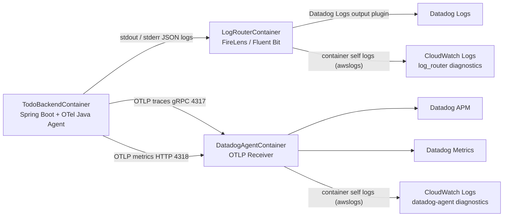

# Todo ECS Observability 仕様（OpenTelemetry Java Agent 導入後）

## 1. 結論（運用方針）

- `logs` は FireLens を主経路として Datadog Logs へ送る。
- `TodoBackendContainer` のログドライバは `awsfirelens` であり、アプリログは CloudWatch Logs へ直接は送らない。
- `DatadogAgentContainer` と `LogRouterContainer` は `awslogs` を使い、sidecar 診断ログを CloudWatch Logs に保存する。
- `Trace / Span（自動計装）` は OpenTelemetry Java Agent が生成し、Datadog Agent sidecar の OTLP/gRPC `4317` へ送る。
- `Trace / Span（業務/手動計装）` は Java Agent が自動生成しない Todo 業務操作に限定し、OpenTelemetry API で作成する。
- `Metrics` は OpenTelemetry Java Agent が OTLP/HTTP `4318` へ送る。対象は JDBC / database client metrics、JVM Runtime Metrics、Java Agent Micrometer instrumentation 経由の既存業務 metrics を含む。
- `OTEL_LOGS_EXPORTER=none` を維持し、OTLP logs 経路は使わない。

## 1.1 関連 ADR

- `docs/adr/adr-0001-o11y-datadog-otel-ecs-fargate.md`
- `docs/adr/adr-0002-trace-correlation-otel-datadog.md`
- `docs/adr/adr-0003-OTel-DatadogAgent-settings.md`
- `docs/adr/adr-0004-OTel-Java-Agent.md`

## 2. 全体構成

## 3. Signal 別実装方式

| Signal | 生成元 | アプリ内の主役 | ECS task 内の経路 | Datadog 側 | 設計上の注意点 |
| --- | --- | --- | --- | --- | --- |
| logs | SLF4J / Logback JSON | Spring Boot structured logging + MDC | app stdout -> FireLens | Datadog Logs | app logs は CloudWatch Logs へ直接送らない。OTLP logs は使わない |
| Trace / Span（自動計装） | `opentelemetry-javaagent.jar` | Java Agent 内蔵 OpenTelemetry SDK / OTLP exporter | app -> OTLP/gRPC `localhost:4317` -> Datadog Agent | Datadog APM | Servlet / Spring Web MVC / JDBC などの framework / library span を自動生成する |
| Trace / Span（業務/手動計装） | `TodoOperationTelemetryAspect` | OpenTelemetry API + Java Agent の `GlobalOpenTelemetry` | app -> OTLP/gRPC `localhost:4317` -> Datadog Agent | Datadog APM | Java Agent は任意の業務メソッドをすべて自動 span 化しないため、低カーディナリティ operation に限定する |
| Metrics（JDBC / Runtime / Micrometer） | `opentelemetry-javaagent.jar` | Java Agent metrics exporter | app -> OTLP/HTTP `localhost:4318/v1/metrics` -> Datadog Agent | Datadog Metrics | JDBC / HikariCP / Runtime Metrics は確認済み。既存 Micrometer JVM metrics との重複は運用ダッシュボード上で継続確認する |
| 業務 metrics | `BusinessMetricsService` | Micrometer `MeterRegistry` + Java Agent Micrometer instrumentation | app -> OTLP/HTTP `localhost:4318/v1/metrics` -> Datadog Agent | Datadog Metrics | `todo.operation.*` は Micrometer API を維持し、Datadog Metrics API で到達確認済み |

## 4. コンポーネント責務

| コンポーネント | 主責務 | この構成での利用 |
| --- | --- | --- |
| OpenTelemetry Java Agent | JVM attach による自動計装、OTLP traces / metrics export、Logback MDC instrumentation | Spring Web MVC / JDBC / Runtime / Micrometer instrumentation の主経路 |
| FireLens（Fluent Bit） | ログルーティング | app ログを Datadog Logs へ転送 |
| Datadog Agent sidecar | OTLP 受信・Datadog 送信 | traces（gRPC 4317）と metrics（HTTP 4318）を受信 |
| `TodoOperationTelemetryAspect` | Java Agent が自動生成しない Todo 業務操作 span と `todo.operation.*` metrics の記録 | `todo.list|get|create|update|delete` に限定 |
| `BusinessMetricsService` | 業務 metrics の Micrometer 記録 | `todo.operation.count` / `todo.operation.duration` を維持 |
| OTel Logs exporter | OTel logs の OTLP 送信 | 使用しない（`OTEL_LOGS_EXPORTER=none`） |
| CloudWatch Logs（sidecar） | 診断ログ保存 | `log_router` / `datadog-agent` のコンテナ標準出力を保存 |

### 4.1 FireLens / Datadog Agent / OpenTelemetry Java Agent を分ける理由

この構成では、同じ「Observability」でも signal ごとに最適な担当を分ける。

| コンポーネント | 分ける理由 |
| --- | --- |
| OpenTelemetry Java Agent | アプリ JVM 内で bytecode instrumentation を行い、HTTP / Spring / JDBC / Runtime / Micrometer の traces / metrics を生成するため。ログ配送プロセスではないため、stdout ログ転送は担当しない。 |
| Datadog Agent sidecar | OTLP traces / metrics を task 内で受け、Datadog APM / Metrics へ送るため。Datadog API Key を app コンテナへ直接持たせず、OTLP receiver と Datadog 送信を sidecar に閉じる。 |
| FireLens（Fluent Bit） | app stdout / stderr の JSON ログを Datadog Logs へ送るため。ECS メタデータ付与、gzip、TLS、Datadog Logs plugin などログ配送の責務を JVM から分離する。 |

この分離により、アプリコードは OpenTelemetry API / Micrometer API / SLF4J に留まり、Datadog 固有のログ配送実装や Datadog tracer API に依存しない。あわせて、OTLP logs を使わないことで FireLens 経路との二重送信と二重課金を避ける。

### 4.2 CloudWatch Logs に出るもの / 出ないもの

- `TodoBackendContainer` のアプリログは `awsfirelens` 経由で FireLens に渡され、Datadog Logs へ送られる。CloudWatch Logs へ直接は出ない。
- `LogRouterContainer` の Fluent Bit 内部ログ、Datadog Logs 転送エラー、設定読み込みエラーは CloudWatch Logs に出る。
- `DatadogAgentContainer` の OTLP receiver、APM/metrics 送信、Agent health に関する診断ログは CloudWatch Logs に出る。
- ECS Service / Task の状態変化は ECS control plane のイベントとして扱う。アプリログの CloudWatch Logs 出力とは別物であり、本リポジトリでは app コンテナ用の CloudWatch Logs log driver は定義しない。

## 5. コンテナ別ログドライバ仕様

| コンテナ | logDriver | 主な送信先 | CloudWatch Logs に出るもの | 保持日数 |
| --- | --- | --- | --- | --- |
| `TodoBackendContainer` | `awsfirelens` | Datadog Logs | 原則出ない（直接は送らない） | なし |
| `LogRouterContainer` | `awslogs` | CloudWatch Logs | Fluent Bit / FireLens の内部ログ、転送エラー | dev=3日, stg=7日, prod=14日 |
| `DatadogAgentContainer` | `awslogs` | CloudWatch Logs | Datadog Agent の内部ログ、OTLP 受信/送信の診断ログ | dev=3日, stg=7日, prod=14日 |

## 6. 主要設定

### 6.1 `TodoBackendContainer` の O11y 関連環境変数

| 変数名 | 値 | 役割 |
| --- | --- | --- |
| `JAVA_TOOL_OPTIONS` | `-javaagent:/app/opentelemetry-javaagent.jar` | OpenTelemetry Java Agent を JVM 起動時に attach する |
| `OTEL_TRACES_EXPORTER` | `otlp` | trace exporter 有効化 |
| `OTEL_EXPORTER_OTLP_TRACES_ENDPOINT` | `http://localhost:4317` | trace の送信先 |
| `OTEL_EXPORTER_OTLP_TRACES_PROTOCOL` | `grpc` | trace 送信 protocol |
| `OTEL_METRICS_EXPORTER` | `otlp` | metrics exporter 有効化 |
| `OTEL_EXPORTER_OTLP_METRICS_ENDPOINT` | `http://localhost:4318/v1/metrics` | metrics の送信先 |
| `OTEL_EXPORTER_OTLP_METRICS_PROTOCOL` | `http/protobuf` | metrics 送信 protocol |
| `OTEL_EXPORTER_OTLP_METRICS_TEMPORALITY_PREFERENCE` | `delta` | Datadog OTLP metrics ingest 向けの temporality |
| `OTEL_LOGS_EXPORTER` | `none` | OTLP logs 無効化 |
| `OTEL_SEMCONV_STABILITY_OPT_IN` | `database` | JDBC / database semantic conventions の明示 |
| `OTEL_INSTRUMENTATION_MICROMETER_ENABLED` | `true` | Micrometer metrics を Java Agent instrumentation の対象にする |
| `OTEL_INSTRUMENTATION_RUNTIME_TELEMETRY_ENABLED` | `true` | JVM Runtime Metrics を Java Agent で取得する |
| `OTEL_INSTRUMENTATION_COMMON_DB_STATEMENT_SANITIZER_ENABLED` | `true` | SQL statement の機密値漏えいを抑止する |
| `OTEL_SERVICE_NAME` | `todo-backend` | OTel service 名 |
| `OTEL_RESOURCE_ATTRIBUTES` | `service.name=todo-backend,service.version=<imageTag>,deployment.environment=<env>` | service / version / env の統一 |
| `DD_SERVICE` | `todo-backend` | Datadog Unified Service Tagging |
| `DD_ENV` | `<env>` | Datadog Unified Service Tagging |
| `DD_VERSION` | `<imageTag>` | Datadog Unified Service Tagging |

削除済みの旧設定:

- `MANAGEMENT_OPENTELEMETRY_TRACING_EXPORT_OTLP_ENDPOINT`
- `MANAGEMENT_OPENTELEMETRY_TRACING_EXPORT_OTLP_TRANSPORT`
- `MANAGEMENT_OTLP_METRICS_EXPORT_URL`
- generic `OTEL_EXPORTER_OTLP_ENDPOINT`
- generic `OTEL_EXPORTER_OTLP_PROTOCOL`

### 6.2 `DatadogAgentContainer` の設定

| 設定 | 値 | 役割 |
| --- | --- | --- |
| image | `public.ecr.aws/datadog/agent:7.81.2` | Datadog Agent を `latest` ではなく明示バージョンで固定する |
| `DD_API_KEY` | Secrets Manager から注入 | Datadog 認証 |
| `DD_SITE` | `datadoghq.com` | Datadog site |
| `ECS_FARGATE` | `true` | Fargate 実行最適化 |
| `DD_APM_ENABLED` | `true` | APM/trace 受信有効化 |
| `DD_APM_NON_LOCAL_TRAFFIC` | `true` | app コンテナからの受信許可 |
| `DD_OTLP_CONFIG_RECEIVER_PROTOCOLS_GRPC_ENDPOINT` | `0.0.0.0:4317` | OTLP/gRPC 受け口 |
| `DD_OTLP_CONFIG_RECEIVER_PROTOCOLS_HTTP_ENDPOINT` | `0.0.0.0:4318` | OTLP/HTTP 受け口 |
| `DD_APM_IGNORE_RESOURCES` | `^GET /actuator/health(/.*)?$,^HEAD /actuator/health(/.*)?$` | health check trace の APM 除外 |
| `DD_APM_MAX_TPS` | `2` | APM スループット制御。初期値は維持し canary 後に調整判断 |
| `DD_APM_ERROR_TPS` | `10` | エラートレース制御。初期値は維持 |
| `DD_CHECKS_TAG_CARDINALITY` | `orchestrator` | ECS task 粒度タグ付与 |
| `DD_SERVICE` | `todo-backend` | Unified Service Tagging |
| `DD_ENV` | `<env>` | Unified Service Tagging |
| `DD_VERSION` | `<imageTag>` | Unified Service Tagging |
| `DD_TAGS` | `team:o11y-CoE,system:todo,aws_account:<accountId>` | 補助タグ。`service/env/version` は重複定義しない |

### 6.3 Task / sidecar リソース値

| 対象 | CPU | Memory Limit | Memory Reservation |
| --- | --- | --- | --- |
| ECS Task 全体 | 1024 CPU units | 2048 MiB | - |
| `DatadogAgentContainer` | 256 CPU units | 512 MiB | 256 MiB |
| `LogRouterContainer` | 64 CPU units | 128 MiB | 64 MiB |

Java Agent 導入後もこの値を初期値として維持します。OOM kill、CPU throttling、startup time 増加が許容できない場合のみ、Fargate task size または sidecar resource の調整を後続タスク化します。

### 6.4 `awsfirelens` 出力オプション

| オプション | 値 | 役割 |
| --- | --- | --- |
| `enableECSLogMetadata` | `true` | ECS メタデータ（task_arn など）をログへ付与 |
| `Name` | `datadog` | Datadog 出力プラグイン指定 |
| `Host` | `http-intake.logs.datadoghq.com` | Datadog Logs 送信先ホスト |
| `TLS` | `on` | TLS 通信 |
| `compress` | `gzip` | 転送量削減 |
| `provider` | `ecs` | ECS メタデータ連携 |
| `dd_service` | `todo-backend` | Datadog サービス名 |
| `dd_source` | `java` | Datadog ログソース |
| `dd_tags` | `env:<env>,version:<imageTag>,team:o11y-CoE,system:todo,aws_account:<accountId>` | Datadog タグ |
| `dd_message_key` | `log` | 主要メッセージキー |

## 7. `/actuator/health` の扱い

- `/actuator/health` は ALB health check のため維持する。
- APM span は Datadog Agent sidecar の `DD_APM_IGNORE_RESOURCES` で除外する。
- HTTP server metrics に `/actuator/health` が含まれる場合でも、API SLO / dashboard / monitor 側で除外する。
- Datadog APM 上では `/actuator/health` span が除外され、`/api/todos` や JDBC span は除外されていないことを prod canary 相当の deploy 後に確認済み。

## 8. Datadog 画面での確認方針

Datadog UI 上の表示名は、環境・Agent バージョン・OTLP mapping に依存します。そのため、未確認の metric 名は断定しません。確認済みの metric API 名は「確認事項 / TODO」に記録します。

### 8.1 Logs

- `service:todo-backend env:<env> version:<DD_VERSION>` で app logs を検索できることを確認する。
- JSON ログトップレベルに `trace_id` / `span_id` が出ることを確認する。
- `traceId` / `spanId` の旧キーがトップレベルへ復活していないことを確認する。
- `x_amzn_trace_id` は補助情報として出力され、`trace_id` を上書きしていないことを確認する。

### 8.2 APM

- `/api/todos` の request trace が `service:todo-backend env:<env> version:<DD_VERSION>` で検索できることを確認する。
- HTTP server / Servlet / Spring Web MVC span が確認できることを確認する。
- PostgreSQL JDBC query span が確認できることを確認する。
- `todo.list|get|create|update|delete` の業務 span が HTTP server span と同一 trace 内に関連付くことを確認する。
- `/actuator/health` trace が継続的に表示されないことを確認する。

### 8.3 Metrics

- JDBC / database client metrics が Datadog Metrics で確認できることを確認する。
- HikariCP / database pool metrics が Java Agent 対応範囲で確認できることを確認する。
- JVM memory、GC、thread、class loading、process / CPU 関連 Runtime Metrics が確認できることを確認する。
- `todo.operation.count` / `todo.operation.duration` が Datadog Metrics に到達することを確認する。
- Runtime Metrics と既存 Micrometer JVM metrics の重複有無を確認し、必要なら採用系列を整理する。

## 9. 確認事項 / TODO

- TODO: `opentelemetry-javaagent.jar` の checksum 検証を Docker build 内で行うか、社内 artifact mirror 側の検証に委ねるかを決める。
- 確認済み: Docker image 内に `/app/opentelemetry-javaagent.jar` が存在し、非 root 実行ユーザー `spring` から読み取り可能である。
- 確認済み: prod canary 相当の deploy 後、Datadog API で同一 `trace_id` の Logs / Spans を相互検索できる。
- 確認済み: `OTEL_INSTRUMENTATION_MICROMETER_ENABLED=true` で `todo.operation.count` / `todo.operation.duration` が Datadog Metrics に到達する。
- 確認済み: JDBC metrics は `db.client.operation.duration`、`db.client.connection.*` として Datadog Metrics で確認できる。
- 確認済み: HikariCP metrics は `hikaricp.connections.*` として Datadog Metrics で確認できる。
- 確認済み: Runtime Metrics は `jvm.memory.*`、`jvm.gc.*`、`jvm.threads.*`、`jvm.classes.*`、`jvm.cpu.*`、`process.cpu.*`、`system.cpu.*` として Datadog Metrics で確認できる。
- 確認済み: `DD_APM_IGNORE_RESOURCES` は `/actuator/health` を除外し、`/api/todos` や JDBC span を除外していない。
- 確認済み: Java Agent 導入後の ECS task は steady state に到達し、OOM kill / restart / essential container stop は発生していない。

## 10. 参考リンク

- OpenTelemetry Java Agent
  https://opentelemetry.io/docs/zero-code/java/agent/
- OpenTelemetry Java Agent Configuration
  https://opentelemetry.io/docs/zero-code/java/agent/configuration/
- OpenTelemetry Java Agent Supported Libraries
  https://opentelemetry.io/docs/zero-code/java/agent/supported-libraries/
- Datadog Agent OTLP Ingestion
  https://docs.datadoghq.com/opentelemetry/setup/otlp_ingest_in_the_agent/
- Datadog OpenTelemetry Runtime Metrics
  https://docs.datadoghq.com/opentelemetry/integrations/runtime_metrics/?tab=java
- Datadog Unified Service Tagging
  https://docs.datadoghq.com/getting_started/tagging/unified_service_tagging/
