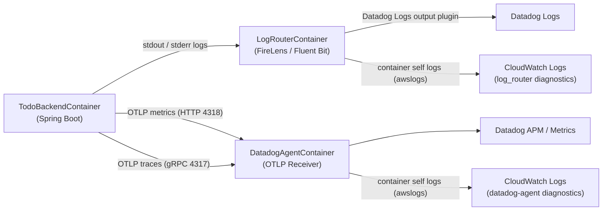

# Todo ECS Observability 仕様（現行）

## 1. 結論（運用方針）

- `logs` は **FireLens** を主経路として Datadog Logs へ送る。
- `TodoBackendContainer` のログドライバは `awsfirelens` であり、アプリログは Datadog Logs へ送られる。
- アプリログは **CloudWatch Logs へ直接は送られない**（現行構成では二重送信しない）。
- ただし `DatadogAgentContainer` と `LogRouterContainer` は `awslogs` のため、sidecar 診断ログは CloudWatch Logs に出力される。
- `metrics` は **Micrometer OTLP Registry** で Datadog Agent の OTLP/HTTP（`4318`）へ送る。
- `trace` は **OpenTelemetry（Micrometer Tracing bridge 含む）** で Datadog Agent の OTLP/gRPC（`4317`）へ送る。
- `OTEL_LOGS_EXPORTER` は `none` とし、OTLP logs 経路は使わない（アプリログは FireLens 経路に統一）。

## 1.1 関連 ADR

- `docs/adr/adr-0001-o11y-datadog-otel-ecs-fargate.md`
- `docs/adr/adr-0002-trace-correlation-otel-datadog.md`
- `docs/adr/adr-0003-OTel-DatadogAgent-settings.md`

## 2. 全体構成



## 3. Signal × 実装方式

| Signal | アプリ側 API | 送信実装 | プロトコル/ポート | タスク内受け先 | Datadog 側 | CloudWatch Logs との関係 |
| --- | --- | --- | --- | --- | --- | --- |
| logs | SLF4J + Logback（JSON） | ECS `awsfirelens` | FireLens プラグイン経由（OTLPではない） | `log_router` | Logs | アプリログは CloudWatch Logs へ直接送られない |
| metrics | Micrometer API（`MeterRegistry`） | Micrometer OTLP Registry | HTTP `4318` (`/v1/metrics`) | `datadog-agent` | Metrics | 送信失敗などの診断ログは `DatadogAgentContainer` の CloudWatch Logs で確認可能 |
| trace | Micrometer Tracing + OTel bridge | OTel OTLP trace exporter | gRPC `4317` | `datadog-agent` | APM / Trace metrics | 受信/転送異常の診断ログは `DatadogAgentContainer` の CloudWatch Logs で確認可能 |

## 4. コンポーネント責務

| コンポーネント | 主責務 | この構成での利用 |
| --- | --- | --- |
| FireLens（Fluent Bit） | ログルーティング | app ログを Datadog Logs へ転送 |
| Datadog Agent sidecar | OTLP受信・Datadog送信 | traces（gRPC）と metrics（HTTP）を受信 |
| Micrometer OTLP Registry | Micrometer metrics の OTLP送信 | metrics のみで使用 |
| OTel Logs exporter | OTel logs の OTLP送信 | 使用しない（`OTEL_LOGS_EXPORTER=none`） |
| CloudWatch Logs（sidecar） | 診断ログ保存 | `log_router` / `datadog-agent` のコンテナ標準出力を保存（app ログは対象外） |

### 4.1 コンテナ別ログドライバ仕様（CloudWatch Logs）

| コンテナ | logDriver | 主な送信先 | CloudWatch Logs に出るもの | 保持日数 |
| --- | --- | --- | --- | --- |
| `TodoBackendContainer` | `awsfirelens` | Datadog Logs（FireLens 経由） | 原則出ない（直接は送らない） | なし |
| `LogRouterContainer` | `awslogs` | CloudWatch Logs | Fluent Bit / FireLens の内部ログ、転送エラー | dev=3日, stg=7日, prod=14日 |
| `DatadogAgentContainer` | `awslogs` | CloudWatch Logs | Datadog Agent の内部ログ、OTLP受信/送信の診断ログ | dev=3日, stg=7日, prod=14日 |

- 補足: 「Datadog Agent の CloudWatch Logs を確認する」とは、`DatadogAgentContainer` の `awslogs` 出力を確認することを指す。  
  例: `Failed to publish metrics to OTLP receiver` や `Connection refused` のようなメトリクス経路の障害調査に使う。

## 5. 主要設定（現行）

| 種別 | 設定 | 値 |
| --- | --- | --- |
| trace | `MANAGEMENT_OPENTELEMETRY_TRACING_EXPORT_OTLP_ENDPOINT` | `http://localhost:4317` |
| trace | `MANAGEMENT_OPENTELEMETRY_TRACING_EXPORT_OTLP_TRANSPORT` | `grpc` |
| trace | `OTEL_EXPORTER_OTLP_ENDPOINT` | `http://localhost:4317` |
| trace | `OTEL_EXPORTER_OTLP_PROTOCOL` | `grpc` |
| metrics | `MANAGEMENT_OTLP_METRICS_EXPORT_URL` | `http://localhost:4318/v1/metrics` |
| metrics | `OTEL_EXPORTER_OTLP_METRICS_ENDPOINT` | `http://localhost:4318/v1/metrics` |
| logs | `OTEL_LOGS_EXPORTER` | `none` |
| agent | `DD_OTLP_CONFIG_RECEIVER_PROTOCOLS_GRPC_ENDPOINT` | `0.0.0.0:4317` |
| agent | `DD_OTLP_CONFIG_RECEIVER_PROTOCOLS_HTTP_ENDPOINT` | `0.0.0.0:4318` |

### 5.1 CDKでECS Taskに追加しているコンテナ

| コンテナ | 目的 | イメージ | logDriver | 主要ポート |
| --- | --- | --- | --- | --- |
| `TodoBackendContainer` | API 本体（Spring Boot） | ECR `todo:<imageTag>` | `awsfirelens` | `8080/TCP` |
| `LogRouterContainer` | FireLens（Fluent Bit）ログルーター | `public.ecr.aws/aws-observability/aws-for-fluent-bit:stable` | `awslogs` | `24224/TCP` |
| `DatadogAgentContainer` | Datadog Agent sidecar（OTLP受信） | `public.ecr.aws/datadog/agent:latest` | `awslogs` | `4317/TCP`, `4318/TCP` |

### 5.2 CDKで定義しているTask/sidecarリソース値

| 対象 | CPU | Memory Limit | Memory Reservation |
| --- | --- | --- | --- |
| ECS Task 全体 | 1024 CPU units | 2048 MiB | - |
| `DatadogAgentContainer` | 256 CPU units | 512 MiB | 256 MiB |
| `LogRouterContainer` | 64 CPU units | 128 MiB | 64 MiB |

### 5.3 `TodoBackendContainer` の O11y 関連環境変数（CDK定義）

| 変数名 | 値（現行） | 役割 |
| --- | --- | --- |
| `MANAGEMENT_OPENTELEMETRY_TRACING_EXPORT_OTLP_ENDPOINT` | `http://localhost:4317` | trace の送信先（Agent gRPC） |
| `MANAGEMENT_OPENTELEMETRY_TRACING_EXPORT_OTLP_TRANSPORT` | `grpc` | trace 送信プロトコル固定 |
| `MANAGEMENT_OTLP_METRICS_EXPORT_URL` | `http://localhost:4318/v1/metrics` | Micrometer metrics の送信先（Agent HTTP） |
| `OTEL_EXPORTER_OTLP_ENDPOINT` | `http://localhost:4317` | OTLP 既定送信先（trace） |
| `OTEL_EXPORTER_OTLP_PROTOCOL` | `grpc` | OTLP 既定プロトコル（trace） |
| `OTEL_EXPORTER_OTLP_METRICS_ENDPOINT` | `http://localhost:4318/v1/metrics` | metrics だけ HTTP 送信先を個別指定 |
| `OTEL_TRACES_EXPORTER` | `otlp` | trace exporter 有効化 |
| `OTEL_METRICS_EXPORTER` | `otlp` | metrics exporter 有効化（補助設定） |
| `OTEL_LOGS_EXPORTER` | `none` | OTLP logs 経路を無効化 |
| `OTEL_SERVICE_NAME` | `todo-backend` | OTel service 名を固定 |
| `OTEL_RESOURCE_ATTRIBUTES` | `service.name=todo-backend,service.version=<imageTag>,deployment.environment=<env>` | logs/traces/metrics の相関タグ統一 |
| `DD_SERVICE` | `todo-backend` | Datadog Unified Service Tagging |
| `DD_ENV` | `<env>` (`dev/stg/prod`) | Datadog Unified Service Tagging |
| `DD_VERSION` | `<imageTag>` | Datadog Unified Service Tagging |
| `SPRING_SECURITY_OAUTH2_RESOURCESERVER_JWT_ISSUER_URI` | `<Cognito issuer URL>` | JWT issuer 検証先（CloudFormation で解決した値を注入） |

### 5.4 `DatadogAgentContainer` の環境変数（CDK定義）

| 変数名 | 値（現行） | 役割 |
| --- | --- | --- |
| `ECS_FARGATE` | `true` | Fargate 実行最適化 |
| `DD_APM_ENABLED` | `true` | APM/trace 受信有効化 |
| `DD_APM_NON_LOCAL_TRAFFIC` | `true` | app コンテナからの受信許可 |
| `DD_CHECKS_TAG_CARDINALITY` | `orchestrator` | ECS タスク粒度タグ付与 |
| `DD_OTLP_CONFIG_RECEIVER_PROTOCOLS_GRPC_ENDPOINT` | `0.0.0.0:4317` | OTLP/gRPC 受け口 |
| `DD_OTLP_CONFIG_RECEIVER_PROTOCOLS_HTTP_ENDPOINT` | `0.0.0.0:4318` | OTLP/HTTP 受け口 |
| `DD_SITE` | `datadoghq.com` | Datadog site |
| `DD_ENV` | `<env>` | Unified Service Tagging |
| `DD_SERVICE` | `todo-backend` | Unified Service Tagging |
| `DD_VERSION` | `<imageTag>` | Unified Service Tagging |
| `DD_TAGS` | `team:o11y-CoE,system:todo,aws_account:<accountId>` | 補助タグ付与 |
| `DD_APM_MAX_TPS` | `2` | APM 送信制御 |
| `DD_APM_ERROR_TPS` | `10` | エラートレース送信制御 |

### 5.5 `awsfirelens` 出力オプション（`TodoBackendContainer`）

| オプション | 値（現行） | 役割 |
| --- | --- | --- |
| `enableECSLogMetadata` | `true` | ECS メタデータ（task_arn など）をログへ付与 |
| `Name` | `datadog` | Datadog 出力プラグイン指定 |
| `Host` | `http-intake.logs.datadoghq.com` | Datadog Logs 送信先ホスト |
| `TLS` | `on` | TLS 通信 |
| `compress` | `gzip` | 転送量削減 |
| `provider` | `ecs` | ECS メタデータ連携 |
| `dd_service` | `todo-backend` | Datadog サービス名 |
| `dd_source` | `java` | Datadog ログソース |
| `dd_tags` | `env:<env>,version:<imageTag>,team:o11y-CoE,system:todo,aws_account:<accountId>` | Datadog タグ |
| `dd_message_key` | `log` | 主要メッセージキー |

### 5.6 ECS Task のシークレット注入（CDK定義）

| コンテナ | 変数名 | 取得元 |
| --- | --- | --- |
| `DatadogAgentContainer` | `DD_API_KEY` | Secrets Manager `/<env>/todo-backend/datadog/api-key` |
| `TodoBackendContainer` | `SPRING_DATASOURCE_HOST` / `PORT` / `DBNAME` / `USERNAME` / `PASSWORD` | Secrets Manager `/todo/<env>/backend/database` |

## 6. 実装上の注意点

### 6.1 Spring Boot の O11y API 方針

- Spring Boot の Observability は Micrometer Observation を中核にしており、アプリケーションメトリクスは Micrometer API（`MeterRegistry`）を使う設計を標準とする。
- 本構成では trace は OpenTelemetry exporter（gRPC 4317）を使うが、metrics は Micrometer OTLP Registry（HTTP 4318）を使う。
- OTel SDK の Metrics API と Micrometer API を同時に業務メトリクスで使うと、同義メトリクスの二重化やタグ運用の不整合が起きやすい。
- そのため本リポジトリでは、業務メトリクスは `BusinessMetricsService` で Micrometer API に統一する（`todo.operation.count` / `todo.operation.duration`）。

### 6.2 OTLP metrics の実装制約

- Micrometer OTLP Registry は既定で HTTP 送信となる。
- Micrometer OTLP Registry で gRPC を使いたい場合は、`OtlpMetricsSender` の独自実装が必要。

## 7. 参考リンク

- Spring Boot Observability  
  https://docs.spring.io/spring-boot/reference/actuator/observability.html
- Spring Boot Metrics（OTLP / `OtlpMetricsSender`）  
  https://docs.spring.io/spring-boot/reference/actuator/metrics.html
- Micrometer OTLP（既定HTTP / gRPC senderは自前実装）  
  https://docs.micrometer.io/micrometer/reference/implementations/otlp.html
- Datadog Agent OTLP Ingestion（4317 gRPC / 4318 HTTP）  
  https://docs.datadoghq.com/opentelemetry/setup/otlp_ingest_in_the_agent/
- OpenTelemetry with Spring Boot（Spring公式ブログ）  
  https://spring.io/blog/2025/11/18/opentelemetry-with-spring-boot/
- Datadog Metrics Explorer  
  https://docs.datadoghq.com/metrics/explorer/
- Datadog Metrics Summary  
  https://docs.datadoghq.com/metrics/summary/
- Datadog Log Explorer Search  
  https://docs.datadoghq.com/logs/explorer/search/
- Datadog Trace Explorer Search  
  https://docs.datadoghq.com/tracing/trace_explorer/search/
- Datadog Unified Service Tagging  
  https://docs.datadoghq.com/getting_started/tagging/unified_service_tagging/

## 8. Datadog 画面での確認手順（Logs / Metrics / Traces）

### 8.1 共通準備

- Datadog Site は `datadoghq.com`（US1）を前提とする。
- まず `service/env/version` を固定して検索する。
  - `service:todo-backend`
  - `env:prod`
  - `version:<DD_VERSION>`
- `DD_VERSION` は、デプロイしたイメージタグ（例: `TodoAppEcrImageTag`）を使う。
- API 実行直後に値が見えない場合があるため、1〜2 分待って再読み込みする。

### 8.2 Logs（Log Explorer）

- 画面: `Logs > Explorer`
- 基本クエリ:

```text
service:todo-backend env:prod version:<DD_VERSION>
```

- 業務ログ確認（Todo 操作）:

```text
service:todo-backend env:prod version:<DD_VERSION> ("Todo created" OR "Todo updated" OR "Todo deleted")
```

- 既知エラー再発確認（0件が期待値）:

```text
service:todo-backend env:prod version:<DD_VERSION> "Failed to publish metrics to OTLP receiver"
```

- 1件ログを開き、タグ/属性で以下を確認する。
  - `service`, `env`, `version`
  - `task_arn`, `task_version`, `cluster_name`（ECS 連携）
  - `trace_id`, `span_id`（出るログのみ）

### 8.3 Metrics（Metrics Summary / Explorer）

- 画面1: `Metrics > Summary`
  - メトリクス名で存在確認:
    - `todo.operation.count`
    - `todo.operation.duration`

- 画面2: `Metrics > Explorer`
  - `BusinessMetricsService` の確認クエリ:

```text
sum:todo.operation.count{service:todo-backend,env:prod,version:<DD_VERSION>,result:success} by {operation}
```

```text
sum:todo.operation.count{service:todo-backend,env:prod,version:<DD_VERSION>,result:failure} by {operation}
```

```text
avg:todo.operation.duration{service:todo-backend,env:prod,version:<DD_VERSION>} by {operation,result}
```

- 期待値:
  - `todo.operation.count{result:success}` に `operation:todo.create|get|list|update|delete`（および `todo.service.*`）が出る。
  - `todo.operation.count{result:failure}` は通常 0 に近い（異常系テスト時のみ増加）。
  - `todo.operation.duration` は運用条件により見え方が異なるため、未表示時は time range と送信設定を再確認する。

### 8.4 Traces（Trace Explorer）

- 画面: `APM > Traces`（Trace Explorer）
- 基本クエリ:

```text
service:todo-backend env:prod version:<DD_VERSION>
```

- 表示設定の例:
  - Visualization: `List` または `Timeseries`
  - Group by: `resource_name`（必要に応じて `operation_name`）

- 期待値:
  - 直近の API 実行後に span が増える。
  - span 詳細で `service/env/version` が一致する。
  - 必要に応じて `task_version` などのタグでデプロイ世代を判別できる。

### 8.5 Logs ↔ Traces 相関の見方

- Log Explorer で `trace_id` が入っているログを開く。
- Datadog UI の trace 連携リンク（または `trace_id` 検索）で該当トレースへ遷移する。
- 1つの操作で、以下が同一 `service/env/version` 軸で揃うことを確認する。
  - ログ（Log Explorer）
  - トレース（Trace Explorer）
  - メトリクス（Metrics Explorer）
