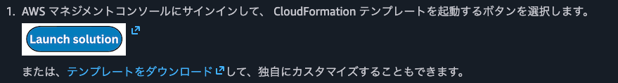

# 負荷テスト - デプロイメント

DLT on AWS については以下を参照ください。

[ソフトウェアアプリケーションのテストを大規模に自動化 - AWS での分散負荷テストソリューション](https://docs.aws.amazon.com/ja_jp/solutions/latest/distributed-load-testing-on-aws/solution-overview.html)

## Launch DLT

[スタックを起動する - AWS での分散負荷テストソリューション](https://docs.aws.amazon.com/ja_jp/solutions/latest/distributed-load-testing-on-aws/launch-the-stack.html)

1. Launch DLT on **ap-northeast-1**

    

2. リージョンを指定します。  

    適切なリージョンを選択してください。    

3. 入力パラメータ  

    入力パラメータは以下を参照してください。
   (注) 新規にVPCを作成すること推奨します。<オプション入力>は指定しません。

| **パラメータ** | **デフォルト** | **説明** |
| --- | --- | --- |
| **Administrator Name** | *<入力必須>* | 最初のソリューション管理者のユーザー名。 |
| **Administrator Email** | `*<入力必須>*` | 管理者ユーザーの E メールアドレス。起動後、コンソールログイン手順が記載された E メールがこのアドレスに送信されます。 |
| **Existing VPC ID** | <オプション入力> | 使用したい VPC があり、既に作成されている場合は、スタックをデプロイしたのと同じリージョンにある既存 VPC の ID を入力してください。例: vpc-1a2b3c4d5e6f |
| **First existing subnet** | <オプション入力> | 既存 VPC 内の 1 つ目のサブネットの ID。このサブネットには、テストを実行するためにコンテナイメージを取り込むためのインターネットへのルートが必要です。例: subnet-7h8i9j0k |
| **Second existing subnet** | <オプション入力> | 既存 VPC 内の 2 つ目のサブネットの ID。このサブネットには、テストを実行するためにコンテナイメージを取り込むためのインターネットへのルートが必要です。例: subnet-1x2y3z |
| **ソリューションで VPC を作成するための有効な CIDR ブロックを提供する** | 192.168.0.0/16 | 既存の VPC を使用している場合は、このパラメータを空白のままにしておくことができます。 |
| **ソリューションが VPC を作成するために、サブネット A の有効な CIDR ブロックを提供する** | 192.168.0.0/20 | AWS Fargate VPC のサブネット A の CIDR ブロック |
| **ソリューションが VPC を作成するために、サブネット B の有効な CIDR ブロックを提供する** | 192.168.16.0/20 | AWS Fargate VPC のサブネット B の CIDR ブロック |
| **Fargate タスクのアウトバウンドトラフィックを許可するための CIDR ブロックを提供する** | 0.0.0.0/0 | Amazon ECS コンテナのアウトバウンドアクセスを制限する CIDR ブロック。 |
| **コンテナイメージを自動更新する** | `No` | 次のマイナーリリースまで、最新の安全なイメージを自動的に使用します。[`No`] を選択すると、セキュリティ更新なしで、最初にリリースされたイメージが取得されます。 |
| **オプションの MCP サーバーをデプロイする** | `No` | AgentCore Gateway を使用してオプションのリモート MCP サーバーをデプロイし、AI アプリケーションを AWS での分散負荷テストに接続します。 |

4. メール受信  

    CloudFormationスタック作成が完了すると、DLTのURLやログインパスワードがメールが来ます。  
    この情報を元にDLTにログインしてください。

    

