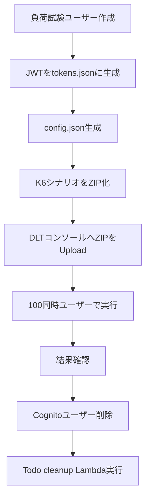

# Load Test: Cognito ユーザー/JWT/DLT 実行運用手順

## この文書の対象

- `prod` 環境での負荷試験ユーザー作成
- `AdminInitiateAuth` による JWT 一括生成
- K6 シナリオの ZIP 化と DLT 画面アップロード
- DLT（Distributed Load Testing on AWS）コンソールでのシナリオ作成・実行
- 試験後の Cognito ユーザー削除と Todo データ cleanup

## 要点

- テスト対象環境は `prod` 固定です。
- JWT 取得は `AdminInitiateAuth`（`ADMIN_USER_PASSWORD_AUTH`）を使用します。
- K6 入力トークンは `tokens.json`（100 件配列）を使用します。
- K6 実行設定は `config.json`（`baseUrl` など）で管理します。
- DLT 提出用 ZIP は `test-case/`（プロジェクトルート基準では `load-test/test-case/`）に出力します。
- 後片付けとして Cognito ユーザー削除と Todo cleanup Lambda 実行を必ず実施します。

## 前提

- 必要ツール
  - AWS CLI v2
  - Python 3.13
  - `pip install -r requirements.txt`
  - `zip` / `unzip`
  - （任意）`k6` ローカルスモーク実行用
- 必要権限（実行主体 IAM）
  - `cloudformation:DescribeStacks`
  - `cognito-idp:AdminCreateUser`
  - `cognito-idp:AdminSetUserPassword`
  - `cognito-idp:AdminInitiateAuth`
  - `cognito-idp:AdminDeleteUser`
  - `cognito-idp:AdminGetUser`
  - `lambda:InvokeFunction`（Todo cleanup Lambda）

## 手順フロー



## 0. 実行ディレクトリ

最初にTerminalで、プロジェクトルートから `load-test/` へ移動します。

```bash
cd load-test/
```

以降のコマンドは、すべて `load-test/` ディレクトリで実行します。

## 1. 環境変数設定
terminalで以下の環境変数を設定します。
```bash
REGION="ap-northeast-1"
STACK_NAME="InfraStack-prod"
USER_PREFIX="loadtest"
USER_DOMAIN="test.local"
USER_COUNT=100
FIXED_PASSWORD='LoadTest-Password1!'
BASE_URL='https://<TodoAppCloudFrontDomainName>'
K6_VUS=100
K6_DURATION='10m'
K6_SLEEP_SECONDS=0.2
K6_MAX_PAGE_SIZE=100
```

(注1) `TodoAppCloudFrontDomainName`はCloudFormationのInfraStack-prodの出力を確認してください。
      例: d26esqfuca40la.cloudfront.net

## 2. 負荷テストユーザー作成（再実行可能）
`scripts/create_cognito_users.py`で、Todoアプリケーション用のテストユーザをCognito User Poolに作成します。

```bash
LOAD_TEST_USER_PASSWORD="${FIXED_PASSWORD}" \
python3.13 scripts/create_cognito_users.py \
  --region "${REGION}" \
  --stack-name "${STACK_NAME}" \
  --user-count "${USER_COUNT}" \
  --user-prefix "${USER_PREFIX}" \
  --user-domain "${USER_DOMAIN}" \
  --sleep-seconds 0.01 \
  --manifest-path scripts/output/users-manifest.json
```

- 既存ユーザーは再作成せず再利用します。
- 毎回 `AdminSetUserPassword` を実行し、パスワード状態を整列します。

## 3. JWT 生成（`AdminInitiateAuth`）
`scripts/generate_tokens.py`で、テストユーザのJWTを作成します。

```bash
LOAD_TEST_USER_PASSWORD="${FIXED_PASSWORD}" \
python3.13 scripts/generate_tokens.py \
  --region "${REGION}" \
  --stack-name "${STACK_NAME}" \
  --user-count "${USER_COUNT}" \
  --user-prefix "${USER_PREFIX}" \
  --user-domain "${USER_DOMAIN}" \
  --sleep-seconds 0.01 \
  --on-failure fail \
  --output-path k6/data/tokens.json
```

- 出力は `tokens.json`（100件配列）です。
- `tokens.json` は機密情報として扱い、不要になったら削除してください。

## 4. K6 設定ファイル生成（`config.json`）
K6シナリオファイル`load-test/k6/scenarios/todo_api_scenario.js`が読み込む環境変数をconfig.jsonとして作成します。
```bash
python3.13 scripts/create_k6_config.py \
  --base-url "${BASE_URL}" \
  --vus "${K6_VUS}" \
  --duration "${K6_DURATION}" \
  --sleep-seconds "${K6_SLEEP_SECONDS}" \
  --max-page-size "${K6_MAX_PAGE_SIZE}" \
  --output-path k6/data/config.json
```

- `todo_api_scenario.js` は `k6/data/config.json` を読み込むため、ZIP 作成前に必ず生成してください。
- `__ENV.BASE_URL` などの K6 環境変数を与えた場合は、`config.json` の値より環境変数を優先します。

## 5. （任意）ローカルスモーク実行
K6のスモークテストを行う場合は以下を実行してください。

```bash
k6 run k6/scenarios/todo_api_scenario.js \
  -e VUS=5 \
  -e DURATION=1m
```

- `k6` が未インストールの場合はこの手順をスキップし、DLT 本実行で確認します。
- `BASE_URL` を環境変数で上書きする場合のみ `-e BASE_URL=...` を追加してください。

## 6. DLT 提出用 ZIP 作成

`scripts/package_dlt_scenario.py`で`load-test/k6`配下のjsとjsonがzip圧縮します。
```text
load-test
  └── k6
      ├── data
      │   ├── config.json
      │   └── tokens.json
      └── scenarios
          └── todo_api_scenario.js
```

```bash
python3.13 scripts/package_dlt_scenario.py \
  --include-tokens \
  --output-dir test-case
```

- 既定名は `dlt-k6-todo-scenario-<timestamp>.zip` です。
- 生成内容確認:

```bash
unzip -l test-case/dlt-k6-todo-scenario-<timestamp>.zip
```

## 7. DLT コンソールで Scenario 作成・実行

画面キャプチャ付きの詳細手順は以下を参照してください。

- [DLT コンソールで Scenario 作成・実行（画面キャプチャ）](./dlt-new-scenario.md)

1. DLT コンソールにログイン
2. `New Scenario` から K6 テストを選択
3. ローカル ZIP（`test-case/dlt-k6-todo-scenario-<timestamp>.zip`）を Upload して指定
4. Traffic shape は 100 同時ユーザーとなるよう設定
5. テスト実行

## 8. DLT テストシナリオ 実行 結果確認

画面キャプチャ付きの確認手順は以下を参照してください。

- [DLT テストシナリオ 実行 結果確認（画面キャプチャ）](./dlt-test-result.md)

- DLT Test Run Metrics Dashboardで以下を確認
  - 成功率
  - レイテンシ
  - スループット
- 必要に応じて CloudWatch Logs と対象アプリのメトリクスを確認

## 9. テスト後の Cognito ユーザー削除（任意）

```bash
python3.13 scripts/delete_cognito_users.py \
  --region "${REGION}" \
  --stack-name "${STACK_NAME}" \
  --user-count "${USER_COUNT}" \
  --user-prefix "${USER_PREFIX}" \
  --user-domain "${USER_DOMAIN}" \
  --sleep-seconds 0.01 \
  --on-not-found skip \
  --manifest-path scripts/output/deleted-users-manifest.json
```

- 既に削除済みユーザーは `not_found` として扱われ、`--on-not-found skip` の場合は継続実行します。
- `scripts/output/deleted-users-manifest.json` で削除結果（`deleted`/`not_found`）を確認できます。

## 10. テスト後の Todo cleanup（必須）

1. CloudFormation 出力 `TodoTestDataCleanupLambdaFunctionName` を確認
2. Lambda コンソールで対象関数を開く
3. `Test` で以下イベントを実行

`loadtest_` プレフィックスのみ削除:

```json
{
  "userPrefix": "loadtest_"
}
```

全削除（強い操作）:

```json
{
  "userPrefix": "*"
}
```

4. CloudWatch Logs の `targetCount` / `deletedCount` / `status` を確認

## 11. エラー時の再実行方針

- `TooManyRequestsException`:
  - `--sleep-seconds` を増やして再実行
- `AccessDeniedException`:
  - IAM 権限（`AdminInitiateAuth` など）を確認
- `config.json could not be loaded`:
  - `python3.13 scripts/create_k6_config.py ...` を再実行し、`k6/data/config.json` の存在を確認
- 途中中断:
  - 1 から再実行可（ユーザー作成は再整列型）
- `k6` 未導入:
  - ローカルスモークを省略し、DLT で実行確認

## 運用上の注意

- 固定パスワードと `tokens.json` は負荷試験用途に限定してください。
- 実行対象（`prod`）の確認なしにコマンドを実行しないでください。
- `userPrefix=*` は全件削除のため、実行前に対象環境を必ず確認してください。
- 生成物（ZIP、`tokens.json`、`config.json`、manifest）は不要になったら削除してください。

## 関連

- [負荷テスト環境（DLT）デプロイ手順](./load-test-deployment.md)
- [DLT コンソールで Scenario 作成・実行（画面キャプチャ）](./dlt-new-scenario.md)
- [DLT テストシナリオ 実行 結果確認（画面キャプチャ）](./dlt-test-result.md)
- [backend 入口 README](../../backend/README.md)
- [infra 入口 README](../../infra/README.md)
