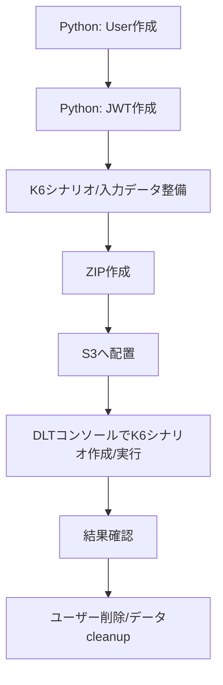

# Spec: 019-DLT-K6-scenario

## 概要
- Distributed Load Testing on AWS（以下 DLT）で、Todo アプリケーションの REST API（`/api/todos`）に対する K6 ベースの負荷試験を実行できる状態を定義する。
- 100 同時ユーザー分の Cognito テストユーザー作成、JWT 生成、K6 シナリオ実行用アーカイブ作成、S3 配置、DLT コンソール実行までを再現可能な運用として整備する。
- 本 feature は **複数領域**（`load-test/`、`infra/`、`docs/`、ルート `README.md`）を対象とする。

## 背景
- 現状は `docs/infra/cognito-load-test-user-operations.md` に Cognito ユーザー運用手順はあるが、DLT シナリオ作成・ZIP 化・S3 アップロード・実行までの一連手順が分断されている。
- `load-test/` 配下に、Todo API 専用の K6 シナリオ資材と前処理スクリプトの標準配置が未定義である。
- 負荷試験を反復実行するための「入力データ生成」「実行資材パッケージ化」「実行後クリーンアップ」の責務分離が不十分で、運用品質を担保しづらい。

## 目的
- Todo API 向けの DLT/K6 シナリオ実行手順を、運用担当者が迷わず再実行できる形で標準化する。
- テストユーザー作成処理と JWT 取得処理を Python 3.13 の独立スクリプトとして分離し、障害時の切り分けと再実行性を向上させる。
- ドキュメント導線を `docs/load-test/` に統一し、インフラ手順と負荷試験手順の責務を明確化する。

## スコープ
- `load-test/` 配下への DLT/K6 関連資材の整備。
  - K6 シナリオ本体（複数 REST API 呼び出し）
  - Cognito テストユーザー作成スクリプト（Python 3.13）
  - JWT 生成スクリプト（Python 3.13、`AdminInitiateAuth` + `ADMIN_USER_PASSWORD_AUTH` を使用し、ユーザー作成処理とは分離）
  - JWT 配布ファイル（`tokens.json`、100件配列）生成
  - シナリオ ZIP 作成手順（作業者負荷が低い方式を採用）
  - DLT 提出用 ZIP の配置先を `load-test/test-case/` とする
  - ドラフト要件ファイル名を `specs-draft.md` に統一する
- `infra/` の Cognito App Client 設定更新。
  - アプリケーションクライアントの認証フローに `AdminInitiateAuth (ADMIN_USER_PASSWORD_AUTH)` を許可する設定を追加する。
  - 既存の認証フロー（`ALLOW_USER_SRP_AUTH`、OAuth code flow）を維持する。
  - 変更内容を `infra/test/infra.test.ts` で検証可能な状態にする。
- ドキュメント更新。
  - `docs/infra/cognito-load-test-user-operations.md` を `docs/load-test/` 配下へ移動し、内容を DLT 実行全体手順へ拡張
  - `docs/README.md` の参照導線更新（移動先リンク反映）
  - ルート `README.md` の負荷試験関連導線更新
- `load-test/` 配下向け `AGENTS.md` の新規作成（DLT 運用前提の作業規約）

## 対象外
- backend API の機能追加・仕様変更・性能チューニング。
- frontend 実装の変更。
- DLT ソリューション自体（CloudFormation スタック）の新規設計変更。
- CI/CD への負荷試験自動組み込み。
- 本番データ保全設計の刷新（既存 cleanup 手順の利用を前提）。

## ユーザーストーリー / 利用シナリオ
- 運用担当者として、100 名分の負荷試験ユーザーを作成し、同一手順で JWT を生成して、認証付き API 負荷試験を即時に開始したい。
- テスト実施者として、K6 シナリオと入力ファイルを ZIP 化して S3 に配置し、DLT コンソールで K6 テストを選択して再現可能に実行したい。
- 保守担当者として、実施後にユーザー削除・Todo cleanup を確実に実行し、次回試験へ影響を残さない状態に戻したい。

## 機能要件
- FR-01: 負荷試験資材は `load-test/` 配下に集約し、DLT へアップロードする ZIP は `load-test/test-case/` 配下に出力されること。
- FR-02: K6 シナリオは `docs/backend/api.md` の API 契約に準拠し、少なくとも複数メソッド（GET/POST/PUT/DELETE）を組み合わせて実行できること。
- FR-03: K6 シナリオは Bearer JWT を利用した認証付きリクエストを実行できること。
- FR-04: Cognito テストユーザー作成スクリプトは Python 3.13 で実装し、JWT 生成処理と別ファイル・別責務であること。
- FR-05: Cognito App Client の認証フローに `ADMIN_USER_PASSWORD_AUTH` を追加し、`AdminInitiateAuth` によるトークン取得を許可すること。
- FR-06: JWT 生成スクリプトは Python 3.13 で実装し、`AdminInitiateAuth` + `ADMIN_USER_PASSWORD_AUTH` を用いて既存ユーザー群の JWT を生成できること。
- FR-07: JWT 配布形式は `tokens.json` に統一し、100 ユーザー分のトークン情報を配列で保持すること。
- FR-08: K6 シナリオは以下の負荷モデルを満たすこと。
  - API 呼び出し比率は `GET 70% / POST 15% / PUT 10% / DELETE 5%` とする。
  - 各ユーザーは初期 Todo 20 件を持つ前提とする。
  - `description` は 100〜300 文字の範囲で生成する。
  - `PUT` / `DELETE` は当該ユーザー所有データからランダム選択し、他ユーザーデータは操作しない。
  - 1 テスト実行あたりの新規作成上限はユーザーごとに 50 件とする。
- FR-09: ユーザー作成および JWT 生成は再実行時に破壊的な副作用を最小化する仕様（冪等または再整列可能）を持つこと。
- FR-10: DLT 実行手順書には以下を含めること。
  - 前提条件（必要権限、リージョン、対象環境）
  - ユーザー作成
  - JWT 作成（`AdminInitiateAuth` 前提）
  - K6 シナリオ ZIP 作成
  - S3 アップロード
  - DLT コンソール操作（Scenario 作成、Traffic Shape 設定、実行）
  - 実行後 cleanup
- FR-11: JWT 生成実行主体には `cognito-idp:AdminInitiateAuth` を含む最小権限 IAM を適用すること。
- FR-12: テスト対象環境は `prod` に固定すること。
- FR-13: `docs/infra/cognito-load-test-user-operations.md` は `docs/load-test/` 配下へ移動し、DLT 運用手順として再編されること。
- FR-14: 参照導線として `docs/README.md` およびルート `README.md` に移動先文書・負荷試験手順へのリンクが追加または更新されること。
- FR-15: `load-test/AGENTS.md` は `infra/AGENTS.md` を参考に、負荷試験資材の配置規約、秘密情報管理、検証範囲、運用上の禁止事項を定義すること。
- FR-16: シナリオ ZIP の作成方法は、手順書運用または補助スクリプトのうち作業者負荷が低い方式を採用すること。
- FR-17: Cleanup 手順には Cognito ユーザー削除と Todo データ削除の両方が含まれること。
- FR-18: 本 feature のドラフト要件ファイル名は `specs-draft.md` とすること。

## 非機能要件
- NFR-01（再現性）: 同一入力・同一環境で同等の試験を再実行できること。
- NFR-02（運用性）: スクリプト失敗時の再実行方針と代表的エラー対処が文書化されること。
- NFR-03（セキュリティ）: 固定パスワード、トークン、個人情報をリポジトリへコミットしない運用であること。
- NFR-04（可観測性）: DLT 実行結果確認先（DLT ダッシュボード/CloudWatch など）が手順書に明記されること。
- NFR-05（互換性）: Python 3.13 と AWS CLI v2 を前提とし、実行環境要件を明示すること。
- NFR-06（性能要件の扱い）: 100 同時ユーザー負荷を基本ケースとして扱い、同時実行制御は DLT の Traffic Shape 設定で調整可能であることを明記すること。
- NFR-07（認可制御）: `AdminInitiateAuth` 実行権限は対象 User Pool/App Client に限定した最小権限で運用すること。

## 受け入れ条件
- AC-01: `load-test/specs/019-DLT-K6-scenario/specs.md` が本書の全セクションを満たしている。
- AC-02: `load-test/` 配下に DLT/K6 資材を配置するための要件と、`infra/` での App Client 認証フロー追加要件が明文化されている。
- AC-03: Python 3.13 で「ユーザー作成」「JWT 生成（`AdminInitiateAuth`）」を分離実装する要件が明文化されている。
- AC-04: JWT 配布形式が `tokens.json`（100件配列）で明記されている。
- AC-05: ドキュメント移動（`docs/infra` → `docs/load-test`）と導線更新（`docs/README.md`、ルート `README.md`）の要件が明記されている。
- AC-06: DLT 実行前後（準備〜cleanup）までの運用要件が一貫して定義されている。
- AC-07: 100 同時ユーザー、`prod` 固定、API 呼び出し比率、データ粒度、新規作成上限が要件として明記されている。
- AC-08: シナリオ ZIP の作成方式が「作業者負荷が低い方式を採用」として明記されている。
- AC-09: ドラフト要件ファイル名が `specs-draft.md` に統一されている。
- AC-10: `ADMIN_USER_PASSWORD_AUTH` の追加が CDK 設定として定義され、関連テスト観点が明記されている。

## 制約
- DLT の K6 実行では、スクリプト内で定義した並列度やステージ設定があっても、実際の同時実行・ランプアップ・保持時間は DLT の Traffic Shape 設定が優先される。
- 認証付き API 試験のため、Cognito User Pool とクライアント設定に依存する。
- `AdminInitiateAuth` を利用するため、Cognito App Client 側で `ADMIN_USER_PASSWORD_AUTH` の許可設定が必須である。
- `AdminInitiateAuth` 実行には IAM 権限評価が適用されるため、実行主体のロール/ユーザー権限管理が必須である。
- 対象 API 契約は `docs/backend/api.md` を正とし、契約外エンドポイントは対象にしない。
- 機密情報（パスワード、JWT、認証情報）を平文で永続化しない。
- 負荷試験対象環境は `prod` に固定し、誤って他環境へ切り替えない運用ガードが必要である。

## 依存関係
- AWS Distributed Load Testing on AWS（DLT）環境（`docs/load-test/load-test-deployment.md`）。
- Cognito User Pool / App Client（CloudFormation 出力値の利用を想定）。
- `infra/lib/constructs/todo-cognito-construct.ts`（App Client authFlows 更新）。
- `infra/test/infra.test.ts`（Cognito App Client 設定の検証更新）。
- Todo API 契約（`docs/backend/api.md`）。
- 既存の cleanup 運用（`TodoTestDataCleanupLambdaFunctionName` を利用する手順）。
- AWS CLI v2、Python 3.13、DLT コンソールアクセス権限。
