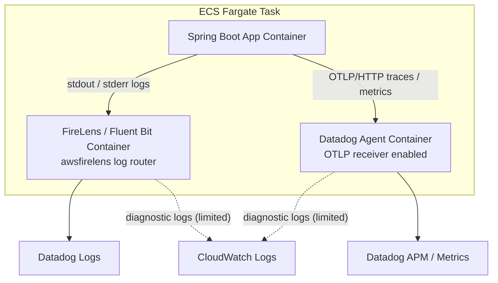

# specs-draft-2.md: infra(AWS CDK / ECS) 向け Datadog / OpenTelemetry オブザーバビリティ実装

- Status: Draft
- Date: 2026-05-21
- Related ADR: `../../docs/adr/adr-0001-o11y-datadog-otel-ecs-fargate.md`
- Related specs: `specs-draft-1.md`（backend 側）
- Target: `infra/` の AWS CDK 実装（ECS/Fargate, FireLens, Datadog Agent, Datadog 運用設定）

## 1. 概要

本仕様は、ECS Fargate 上で稼働する backend コンテナの observability を成立させるため、`infra/` 側で必要な CDK 実装要件を定義する。

本仕様の対象は、ECS タスク定義、Datadog Agent sidecar、FireLens/Fluent Bit、CloudWatch Logs の限定保持、Datadog 側の運用設定である。アプリケーションコード自体の実装は `specs-draft-1.md` の対象とする。

## 2. ゴール

### 2.1 機能ゴール

- ECS タスクで app / datadog-agent / log_router が同時に起動する。
- app ログが FireLens 経由で Datadog Logs に到達する。
- app の traces / metrics が OTLP/HTTP で Datadog Agent 経由で Datadog APM/Metrics に到達する。
- Datadog 上で `env` / `service` / `version` により横断検索できる。
- FireLens / Datadog Agent の診断ログを CloudWatch Logs に限定的に保持できる。

### 2.2 非機能ゴール

- CloudWatch Logs と Datadog Logs の二重全量長期保持を避ける。
- sidecar 分の CPU / memory をタスク定義に織り込む。
- シークレットを平文で持たない。

## 3. 非ゴール

- backend 業務コードへの `@WithSpan` 追加（backend 側で対応）
- OpenTelemetry Logs API を業務ログ API として利用する構成
- OTLP/gRPC 採用（本仕様では OTLP/HTTP 固定）

## 4. 最終アーキテクチャ



## 5. 要件

### 5.1 Datadog Agent sidecar 要件

#### REQ-INF-DDAGENT-001: Datadog Agent コンテナ

ECS Fargate タスク定義に Datadog Agent コンテナを追加する。

必須環境変数:

```text
ECS_FARGATE=true
DD_APM_ENABLED=true
DD_SITE=<datadog-site>
DD_ENV=<env>
DD_SERVICE=todo-backend
DD_VERSION=<version>
```

`DD_API_KEY` は Secrets Manager 等から secret として注入する。

#### REQ-INF-DDAGENT-002: OTLP receiver (HTTP 固定)

OTLP/HTTP を固定で採用する。Datadog Agent には次を設定する。

```text
DD_OTLP_CONFIG_RECEIVER_PROTOCOLS_HTTP_ENDPOINT=0.0.0.0:4318
```

app コンテナには次を設定する（CDK から環境変数を注入）。

```text
OTEL_EXPORTER_OTLP_ENDPOINT=http://localhost:4318
OTEL_EXPORTER_OTLP_PROTOCOL=http/protobuf
OTEL_TRACES_EXPORTER=otlp
OTEL_METRICS_EXPORTER=otlp
OTEL_LOGS_EXPORTER=none
```

OTLP/gRPC は本仕様では採用しない。

#### REQ-INF-DDAGENT-003: OTLP logs ingestion

Datadog Agent の OTLP logs ingestion は原則有効化しない。

禁止する設定:

```text
DD_OTLP_CONFIG_LOGS_ENABLED=true
```

### 5.2 FireLens / Fluent Bit 要件

#### REQ-INF-FIRELENS-001: FireLens log router

ECS Fargate タスク定義に FireLens / Fluent Bit log router コンテナを追加する。

例:

```json
{
  "name": "log_router",
  "image": "public.ecr.aws/aws-observability/aws-for-fluent-bit:stable",
  "essential": true,
  "firelensConfiguration": {
    "type": "fluentbit",
    "options": {
      "enable-ecs-log-metadata": "true"
    }
  }
}
```

#### REQ-INF-FIRELENS-002: application container log driver

app コンテナの log driver は `awsfirelens` とする。

例:

```json
{
  "logConfiguration": {
    "logDriver": "awsfirelens",
    "options": {
      "Name": "datadog",
      "Host": "http-intake.logs.datadoghq.com",
      "TLS": "on",
      "provider": "ecs",
      "dd_service": "todo-backend",
      "dd_source": "java",
      "dd_tags": "env:<env>,version:<version>",
      "dd_message_key": "message",
      "compress": "gzip"
    },
    "secretOptions": [
      {
        "name": "apikey",
        "valueFrom": "<datadog-api-key-secret-arn>"
      }
    ]
  }
}
```

`backend/` の現行構成では Logback JSON フィールド独自名称が未定義のため、`dd_message_key` は `message` を使用する。

Datadog site が `datadoghq.com` 以外の場合は `Host` を対象 site に合わせる。

#### REQ-INF-FIRELENS-003: `awslogs` と `awsfirelens` の扱い

- 同一コンテナでは `logDriver` を 1 つしか設定できないため、`awslogs` と `awsfirelens` を同時設定しない。
- 同一タスク内ではコンテナごとに別ドライバを設定できるため、app=`awsfirelens`、log_router/datadog-agent=`awslogs` の併用は可能とする。

#### REQ-INF-FIRELENS-004: CloudWatch Logs の用途と保持期間

CloudWatch Logs は限定用途にのみ使用する。

- FireLens log router の診断ログ
- Datadog Agent の診断ログ
- AWS 運用上の短期保険
- 監査上の要件が明確なログ

保持期間は次で固定する。

- application logs: 原則 FireLens -> Datadog のため CloudWatch には送らない
- log_router logs:
  - dev: 3 日
  - stg: 7 日
  - prod: 14 日
- datadog-agent logs:
  - dev: 3 日
  - stg: 7 日
  - prod: 14 日
- Todo: 人間に確認が必要: compliance logs の保持日数（法令・契約要件に依存するため）

### 5.3 Datadog tagging 要件（infra 注入）

#### REQ-INF-TAG-001: Unified Service Tagging

次のタグを logs / traces / metrics で統一する。

- `env`
- `service`
- `version`

CDK から app / datadog-agent に環境変数を注入し、少なくとも次を満たす。

```text
DD_ENV=<env>
DD_SERVICE=todo-backend
DD_VERSION=<version>
OTEL_SERVICE_NAME=todo-backend
OTEL_RESOURCE_ATTRIBUTES=service.name=todo-backend,service.version=<version>,deployment.environment=<env>
```

## 6. Datadog 設定要件

### 6.1 Logs

- `service` / `env` / `version` の整合を確認する。
- JSON parsing を確認する。
- `trace_id` / `span_id` の抽出を確認する。
- Index / Exclusion Filter / retention / daily quota を定義する。
- ERROR / WARN とログ量 monitor を作成する。

### 6.2 APM

- service が表示されること
- HTTP request trace が表示されること
- DB / external HTTP spans が表示されること
- 業務 span が表示されること
- エラー時に span error / exception が確認できること

### 6.3 Metrics

- 業務 metrics が表示されること
- 高カーディナリティ tag が発生していないこと
- monitor で異常検知できること

## 7. 受入条件

### 7.1 ECS / sidecar

- [ ] ECS Fargate タスク定義に `app` / `datadog-agent` / `log_router` が含まれる。
- [ ] Datadog Agent container が正常起動する。
- [ ] FireLens / Fluent Bit container が正常起動する。
- [ ] app container の `logDriver=awsfirelens` が設定される。
- [ ] Datadog API key が `secretOptions` / `secrets` で渡され、平文で定義されない。
- [ ] sidecar の CPU / memory がタスク定義で見積もられている。

### 7.2 コスト

- [ ] Datadog Logs Index / Exclusion Filter / retention / daily quota が定義されている。
- [ ] CloudWatch Logs の用途と保持期間が定義どおりである。
- [ ] Datadog logs ingestion / indexed logs monitor がある。
- [ ] custom metrics / APM ingestion monitor がある。

### 7.3 確認手順（抜粋）

- Logs Explorer: `service:todo-backend env:prod @trace_id:* @span_id:*`
- Trace Explorer: `service:todo-backend env:prod`
- ECS タスク定義:
  - app: `logDriver=awsfirelens`
  - app: `OTEL_EXPORTER_OTLP_PROTOCOL=http/protobuf`
  - app: `OTEL_EXPORTER_OTLP_ENDPOINT=http://localhost:4318`
  - log_router / datadog-agent の CloudWatch retention が `dev=3日, stg=7日, prod=14日`

## 8. テスト方針

### 8.1 結合環境

- ECS Fargate 上で app / datadog-agent / log_router が同一タスクとして起動すること
- FireLens 経由で Datadog Logs にログが届くこと
- OTLP/HTTP 経由で Datadog APM / Metrics に telemetry が届くこと
- Datadog APM trace と Datadog Logs が相関できること

### 8.2 障害試験

以下を意図的に発生させ、Datadog 上で検知できることを確認する。

- FireLens 転送失敗
- Datadog Agent 起動失敗
- OTLP endpoint 接続失敗

## 9. 運用要件

### 9.1 ダッシュボード

最低限、以下を用意する。

- Service Overview
- APM Latency / Throughput / Error
- Business Operation Metrics
- ECS Fargate Task Health
- Datadog Logs Usage
- Datadog APM / Metrics Usage

### 9.2 Monitor

最低限、以下を用意する。

- error rate increase
- latency p95 / p99 threshold
- business failure count threshold
- external API failure count threshold
- Datadog Agent unhealthy
- FireLens / Fluent Bit error
- logs ingestion anomaly
- indexed logs anomaly
- custom metrics cardinality anomaly

## 10. 未決事項

- Datadog site（`datadoghq.com` / `ap1.datadoghq.com` / その他）
- env 名の正式値（`dev` / `stg` / `prod`）
- `DD_VERSION` の値の決定方式
- compliance logs の保持日数（法令・契約要件）
- Datadog Index / Exclusion Filter の具体条件
- APM sampling rate
- sidecar 用 CPU / memory の標準値

## 11. 参考資料

- Datadog ECS Fargate integration: https://docs.datadoghq.com/ja/integrations/ecs_fargate/
- Datadog OTLP Ingestion by the Agent: https://docs.datadoghq.com/opentelemetry/interoperability/otlp_ingest_in_the_agent/
- Datadog Correlate OpenTelemetry Traces and Logs: https://docs.datadoghq.com/opentelemetry/correlate/logs_and_traces/
- Datadog Unified Service Tagging: https://docs.datadoghq.com/getting_started/tagging/unified_service_tagging/
- Datadog Log Indexes: https://docs.datadoghq.com/ja/logs/log_configuration/indexes/
- AWS ECS FireLens / AWS for Fluent Bit: https://docs.aws.amazon.com/ja_jp/AmazonECS/latest/developerguide/firelens-using-fluentbit.html
- Fluent Bit Datadog Output Plugin: https://docs.fluentbit.io/manual/pipeline/outputs/datadog
