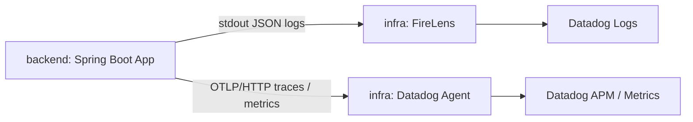

# specs-draft.md: backend(Spring Boot) 向け Datadog / OpenTelemetry オブザーバビリティ実装

- Status: Draft
- Date: 2026-05-21
- Related ADR: `../../docs/adr/adr-0001-o11y-datadog-otel-ecs-fargate.md`
- Related specs: `../004-Datadog-agent-to-cdk/specs-draft.md`（infra / CDK 側）
- Target: `backend/` の Spring Boot 実装

## 1. 概要

本仕様は、`backend/` の Spring Boot アプリケーションに対し、Datadog を主要なオブザーバビリティ基盤として利用するための実装要件を定義する。  
本仕様の対象はアプリケーションコード、アプリ設定、ログ/trace/metrics の設計である。  
ECS タスク定義、FireLens、Datadog Agent のコンテナ定義は `../004-Datadog-agent-to-cdk/specs.md` の対象とする。  

## 2. ゴール

### 2.1 機能ゴール

- アプリケーションログが Datadog Logs で検索できる。
- アプリケーションログに `trace_id` / `span_id` が含まれ、Datadog APM の trace と相関できる。
- 自動計装（HTTP / DB / 外部 HTTP）と手動計装（業務 span）が Datadog APM で確認できる。
- 業務処理の成功/失敗/処理時間が Datadog Metrics で確認できる。
- `env` / `service` / `version` で logs / traces / metrics を横断できる。

### 2.2 非機能ゴール

- 既存の `SLF4J + Logback` を維持し、業務コードへの影響を抑える。
- 手動 span の実装によるコード肥大化を避ける。
- ログ、span、metrics に PII / secrets を出力しない。
- 高カーディナリティ属性を抑制する。

## 3. 非ゴール

- `SLF4J / Logback` を OpenTelemetry Logs API に置き換えること
- 全メソッドへの span 付与
- PII / secrets を出力して後段でマスキングする前提
- ECS タスク定義や FireLens/Datadog Agent コンテナ実装（infra 側で対応）

## 4. 全体構成における backend の境界



## 5. 要件

### 5.1 ログ要件

#### REQ-BE-LOG-001: アプリケーションログ API

アプリケーションコードではログ出力 API として `SLF4J` を使用する。

許可例:

```java
private static final Logger log = LoggerFactory.getLogger(OrderService.class);
```

```java
@Slf4j
@Service
public class OrderService {
}
```

禁止例:

```java
System.out.println("...");
```

#### REQ-BE-LOG-002: ログ出力形式

本番環境のアプリケーションログは JSON 形式で stdout に出力する。

必須フィールド:

- `timestamp`
- `level`
- `logger`
- `thread`
- `message`
- `service`
- `env`
- `version`
- `trace_id`
- `span_id`

推奨フィールド:

- `request_id`
- `correlation_id`
- `error.type`
- `error.message`
- `error.stack`

#### REQ-BE-LOG-003: trace-log correlation

OpenTelemetry の trace context をログへ注入し、Datadog Logs で `trace_id` / `span_id` を top-level field として検索できるようにする。

#### REQ-BE-LOG-004: 出力禁止情報

次の情報をログに出力してはならない。

- password
- access token
- refresh token
- API key
- secret key
- Authorization header 全文
- Cookie 全文
- request body 全文
- response body 全文
- クレジットカード番号
- 銀行口座番号
- 個人番号
- 出力可否が未判断の PII

### 5.2 traces 要件

#### REQ-BE-TRACE-001: OpenTelemetry Spring Boot Starter

Spring Boot アプリケーションに OpenTelemetry Spring Boot Starter を導入する。

Maven 例:

```xml
<dependencyManagement>
    <dependencies>
        <dependency>
            <groupId>io.opentelemetry.instrumentation</groupId>
            <artifactId>opentelemetry-instrumentation-bom</artifactId>
            <version>${opentelemetry.instrumentation.version}</version>
            <type>pom</type>
            <scope>import</scope>
        </dependency>
    </dependencies>
</dependencyManagement>

<dependencies>
    <dependency>
        <groupId>io.opentelemetry.instrumentation</groupId>
        <artifactId>opentelemetry-spring-boot-starter</artifactId>
    </dependency>
    <dependency>
        <groupId>io.opentelemetry.instrumentation</groupId>
        <artifactId>opentelemetry-instrumentation-annotations</artifactId>
    </dependency>
    <dependency>
        <groupId>org.springframework.boot</groupId>
        <artifactId>spring-boot-starter-aop</artifactId>
    </dependency>
</dependencies>
```

#### REQ-BE-TRACE-002: 手動 span の対象

手動 span は業務上意味のある処理境界に限定する。

対象例:

- 注文作成
- 決済承認
- 契約承認
- 顧客情報連携
- バッチ 1 レコード処理

対象外例:

- getter / setter
- 単純な private メソッド
- 1〜2 行の変換処理

#### REQ-BE-TRACE-003: `@WithSpan` 優先

手動 span は原則 `@WithSpan` を優先する。

#### REQ-BE-TRACE-004: 直接 Tracer API の利用制限

`Tracer` / `Span` API の直接利用は、`@WithSpan` では表現できない非同期処理や細かな制御が必要な場合に限定する。業務メソッド内への boilerplate 大量記述は避ける。

#### REQ-BE-TRACE-005: span naming

span 名は業務的意味がわかる名前にする。

推奨:

- `order.create`
- `payment.authorize`
- `contract.approve`

非推奨:

- `execute`
- `process`
- `doSomething`

#### REQ-BE-TRACE-006: span attributes

span attributes は低カーディナリティ値に限定する。

推奨:

- `business.operation`
- `order.type`
- `payment.method`
- `external.system`
- `result.status`
- `error.category`

原則禁止:

- `customer.email`
- `customer.phone`
- `access.token`
- `request.body`

#### REQ-BE-TRACE-007: span events

span events は重要な一時点のみ記録する。

推奨:

```java
Span.current().addEvent("payment.authorization.requested");
Span.current().addEvent("payment.authorization.approved");
```

### 5.3 metrics 要件

#### REQ-BE-METRIC-001: 業務 metrics

業務上重要な数値を OpenTelemetry metrics として出力する。

例:

- `business.order.created.count`
- `business.order.failed.count`
- `business.order.creation.duration`

#### REQ-BE-METRIC-002: metrics attributes

metrics attributes は低カーディナリティ値のみ使用する。

許可例:

- `env`
- `service`
- `operation`
- `result`

禁止例:

- `order.id`
- `customer.id`
- `request.id`
- `email`
- `phone`

#### REQ-BE-METRIC-003: metrics 実装

メトリクス登録は `Meter` を用い、Counter/Histogram を用途別に分ける。単位・説明を付与する。

### 5.4 タグ要件

#### REQ-BE-TAG-001: Unified Service Tagging (アプリ側)

アプリ側で次を一貫設定する。

- `DD_SERVICE=todo-backend`
- `DD_ENV=<env>`
- `DD_VERSION=<version>`
- `OTEL_SERVICE_NAME=todo-backend`
- `OTEL_RESOURCE_ATTRIBUTES=service.name=todo-backend,service.version=<version>,deployment.environment=<env>`

## 6. アプリケーション設定例

### 6.1 application.yml 例

```yaml
otel:
  service:
    name: ${OTEL_SERVICE_NAME:${DD_SERVICE:unknown-service}}
  resource:
    attributes:
      service.name: ${OTEL_SERVICE_NAME:${DD_SERVICE:unknown-service}}
      service.version: ${DD_VERSION:unknown-version}
      deployment.environment: ${DD_ENV:local}

logging:
  level:
    root: INFO
    com.example: INFO
```

### 6.2 logback-spring.xml 例

```xml
<?xml version="1.0" encoding="UTF-8"?>
<configuration>
    <springProperty scope="context" name="service" source="DD_SERVICE" defaultValue="unknown-service"/>
    <springProperty scope="context" name="env" source="DD_ENV" defaultValue="local"/>
    <springProperty scope="context" name="version" source="DD_VERSION" defaultValue="unknown-version"/>

    <appender name="STDOUT" class="ch.qos.logback.core.ConsoleAppender">
        <encoder class="net.logstash.logback.encoder.LogstashEncoder">
            <customFields>{"service":"${service}","env":"${env}","version":"${version}"}</customFields>
            <includeMdcKeyName>trace_id</includeMdcKeyName>
            <includeMdcKeyName>span_id</includeMdcKeyName>
            <includeMdcKeyName>request_id</includeMdcKeyName>
            <includeMdcKeyName>correlation_id</includeMdcKeyName>
        </encoder>
    </appender>

    <root level="INFO">
        <appender-ref ref="STDOUT"/>
    </root>
</configuration>
```

## 7. 実装例

### 7.1 Service span の例

```java
@Slf4j
@Service
public class OrderService {
    @WithSpan("order.create")
    public void createOrder(
            @SpanAttribute("business.operation") String operation,
            @SpanAttribute("order.type") String orderType,
            @SpanAttribute("payment.method") String paymentMethod,
            CreateOrderRequest request
    ) {
        Span.current().addEvent("payment.authorization.requested");
        // business logic
        Span.current().addEvent("payment.authorization.approved");
    }
}
```

## 8. 受入条件

### 8.1 ログ

- [ ] JSON ログが stdout に出力される。
- [ ] ログに `service` / `env` / `version` / `trace_id` / `span_id` が含まれる。
- [ ] 出力禁止情報がログに含まれない。

### 8.2 traces

- [ ] OpenTelemetry Spring Boot Starter が導入されている。
- [ ] `@WithSpan` による業務 span が確認できる。
- [ ] trace から関連ログへ遷移できる。

### 8.3 metrics

- [ ] 業務 metrics が出力される。
- [ ] metrics attributes に高カーディナリティ値が含まれない。

### 8.4 確認手順（抜粋）

- Logs Explorer: `service:todo-backend env:prod @trace_id:* @span_id:*`
- Trace Explorer: `service:todo-backend env:prod`
- `backend/` で依存関係と設定を確認する。

## 9. テスト方針

### 9.1 ローカル / 開発環境

- サンプルリクエストで trace が作成されることを確認する。
- JSON ログに `trace_id` / `span_id` が含まれることを確認する。
- 出力禁止情報がログに出ていないことを確認する。

### 9.2 結合観点（backend 側）

- `specs-draft.md` で定義する infra 構成上で、backend のログ/trace/metrics が Datadog で確認できること。

## 10. 未決事項

- `DD_VERSION` に採用する値（Git SHA / SemVer / CI build number）
- 業務ごとの span 粒度と属性最小集合

## 11. 参考資料

- Spring Boot Logging: https://docs.spring.io/spring-boot/reference/features/logging.html
- OpenTelemetry Spring Boot Starter: https://opentelemetry.io/docs/zero-code/java/spring-boot-starter/
- OpenTelemetry Spring Boot Starter - API: https://opentelemetry.io/docs/zero-code/java/spring-boot-starter/api/
- OpenTelemetry Spring Boot Starter - Annotations: https://opentelemetry.io/docs/zero-code/java/spring-boot-starter/annotations/
- OpenTelemetry Logs API: https://opentelemetry.io/docs/specs/otel/logs/api/
- Datadog Correlate OpenTelemetry Traces and Logs: https://docs.datadoghq.com/opentelemetry/correlate/logs_and_traces/
- Datadog Unified Service Tagging: https://docs.datadoghq.com/getting_started/tagging/unified_service_tagging/
