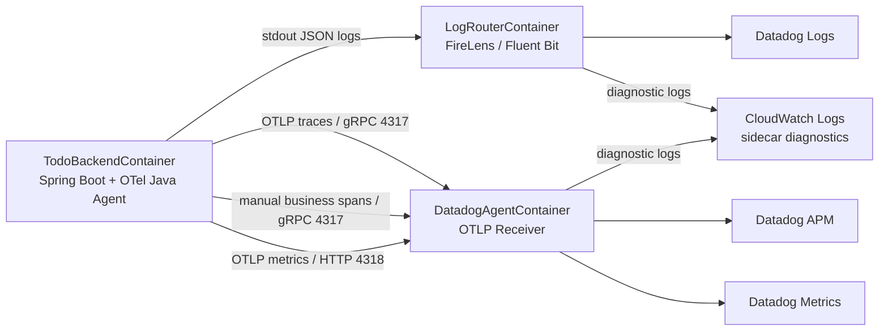

# Spec: OpenTelemetry Java Agent conversion

## 概要

`backend/` の Spring Boot アプリケーションに OpenTelemetry Java Agent（`opentelemetry-javaagent.jar`）を導入し、現行の Spring Boot OpenTelemetry / Micrometer / 独自 AOP による手動計装中心の構成から、Java Agent による自動計装を主軸とする構成へ移行する。

本 feature では、Trace / Span、JDBC instrumentation、Metrics、Runtime Metrics を Java Agent で取得できる状態にする。あわせて、Java Agent が自動生成しない Trace / Span（業務/手動計装）は、必要な operation に限定して継続・見直しする。既存の Datadog Agent sidecar、FireLens によるログ配送、`trace_id` / `span_id` による Logs / APM 相関、Unified Service Tagging は維持する。

本 feature は `backend/`、`infra/`、`docs/` にまたがる。実装対象はバックエンドアプリケーション、ECS Fargate タスク定義、関連ドキュメントであり、公開 API、DB schema、認証認可仕様は変更しない。

## 背景

現行構成では、APM 向けの trace/span と metrics は主に以下の実装で構成されている。

| 領域 | 現行実装 |
| --- | --- |
| Trace / Span | `spring-boot-starter-opentelemetry`、OpenTelemetry API、`PublicMethodTelemetryAspect` |
| 業務 metrics | `BusinessMetricsService` が Micrometer `MeterRegistry` へ `todo.operation.count` / `todo.operation.duration` を記録 |
| Logs / APM 相関 | `trace_id` / `span_id` を主キー、`x_amzn_trace_id` を補助キーとして扱う |
| Trace 経路 | app -> OTLP/gRPC `4317` -> Datadog Agent sidecar -> Datadog APM |
| Metrics 経路 | app -> OTLP/HTTP `4318` -> Datadog Agent sidecar -> Datadog Metrics |
| Logs 経路 | app stdout -> FireLens -> Datadog Logs |
| Sidecar 診断ログ | `DatadogAgentContainer` / `LogRouterContainer` -> CloudWatch Logs |

現行の独自 AOP は Spring 管理 Bean の public method span 作成と業務 metrics 記録を兼ねている。この方式ではアプリ固有処理の span と業務 metrics は取得できるが、JDBC span、JDBC metrics、JVM Runtime Metrics を継続的に手動実装するには保守負荷が高い。

ADR-0004 では、自動計装エージェントとして Datadog Java Tracer ではなく OpenTelemetry Java Agent を採用することが Accepted として決定されている。テレメトリデータは OTLP で Datadog Agent の OTLP ingest エンドポイントへ送信する。

AWS / ECS Fargate 観点では、現行 task は app コンテナ、Datadog Agent sidecar、FireLens sidecar を同一 task 内で動かしている。Java Agent 導入により app JVM のメモリ使用量、span 量、metrics 量が増える可能性があるため、ECS task / container resource、Datadog Agent の受信能力、APM 取り込み制御値をあわせて検証する必要がある。

## 目的

- OpenTelemetry Java Agent により JDBC query span を自動取得する。
- OpenTelemetry Java Agent により JDBC / database client metrics を自動取得する。
- OpenTelemetry Java Agent により JVM Runtime Metrics を自動取得する。
- Trace / Span と自動 metrics の生成主体を Java Agent へ移行し、既存の Spring Boot OTel exporter / Micrometer OTLP exporter / 独自 AOP との二重計装を避ける。
- Java Agent が自動生成しない業務処理単位の span は、Trace / Span（業務/手動計装）として自動計装とは別に扱う。
- 既存の業務 metrics `todo.operation.count` / `todo.operation.duration` を維持する。
- Datadog 上で `service:todo-backend env:<env> version:<imageTag>` を軸に Logs / Traces / Metrics を横断できる状態を維持する。
- ECS Fargate 上で sidecar 診断ログを CloudWatch Logs から切り分けられる運用性を維持する。

## スコープ

### 対象領域

| 領域 | 対象内容 |
| --- | --- |
| `backend/` | Java Agent jar の同梱、JVM attach、依存関係整理、OTel / Micrometer / AOP 関連実装の見直し、関連テスト更新 |
| `infra/` | ECS app コンテナの起動オプション、Java Agent 用環境変数、Datadog Agent sidecar の OTLP receiver 設定、Datadog Agent image pin、Fargate resource 検証 |
| `docs/` | `backend/README.md`、`docs/infra/o11y.md`、`docs/backend/logging.md`、関連 ADR の更新要否確認 |
| Datadog 運用 | Logs / APM / Metrics の到達確認、ログ相関、runtime metrics 表示、APM 取り込み量の確認 |

### 対象 Signal

| Signal | 対応方針 |
| --- | --- |
| Logs | 既存の SLF4J / Logback -> stdout -> FireLens -> Datadog Logs を維持する |
| Trace / Span（自動計装） | Java Agent 自動計装を主経路とし、HTTP server / Spring Web MVC / JDBC span を取得する |
| Trace / Span（業務/手動計装） | Java Agent が自動生成しない業務処理単位の span を、必要な operation に限定して OpenTelemetry API、`@WithSpan`、method instrumentation、限定 AOP のいずれかで維持または追加する |
| Metrics（自動計装） | Java Agent 自動計装を主経路とし、JDBC metrics / Runtime Metrics を取得する |
| 業務 metrics（手動計装） | `todo.operation.*` を維持する。第一候補は Micrometer API 維持とし、必要時のみ OTel Metrics API への移行を検討する |
| OTLP logs | 使用しない。`OTEL_LOGS_EXPORTER=none` を維持する |

### 構成方針

## 対象外

- 公開 API `/api/todos` の仕様変更。
- DB schema / Flyway migration の変更。
- Cognito / JWT 検証 / 認可境界の変更。
- Datadog Java Tracer（`dd-java-agent.jar`）の導入。
- OpenTelemetry Logs の OTLP 送信への切り替え。
- アプリログを CloudWatch Logs へ直接送る構成への変更。
- Datadog DBM、Continuous Profiler、App and API Protection の詳細設計。
- Datadog dashboard / monitor / index / exclusion filter の詳細設計。
- frontend / load-test の機能変更。
- 本 feature と無関係な大規模リファクタリング、広範囲 rename、ファイル移動。

## ユーザーストーリー / 利用シナリオ

- 運用担当者として、Datadog APM の Todo API trace で JDBC query span を確認し、DB アクセスに起因する遅延を特定したい。
- SRE として、Datadog Metrics で JDBC / database client metrics と JVM Runtime Metrics を確認し、アプリケーション負荷、DB 負荷、GC 影響を横断分析したい。
- 開発者として、アプリコードへ JDBC 計装を個別に追加しなくても、Spring Data JPA / PostgreSQL JDBC 経由の DB 操作が trace と metrics に出る状態を維持したい。
- 運用担当者として、Datadog Logs から `trace_id` で該当 trace へ遷移し、trace から関連 logs へ戻れる既存の調査導線を維持したい。
- 開発者として、Java Agent が自動生成しない業務処理単位の span を、必要な operation に限定して維持または追加したい。
- 開発者として、既存の `todo.operation.count` / `todo.operation.duration` を失わず、Java Agent 導入後も業務成功率と処理時間を確認したい。
- インフラ担当者として、Java Agent 導入後も Datadog Agent sidecar と FireLens sidecar の障害を CloudWatch Logs で切り分けたい。

## 機能要件

### REQ-001 Java Agent 採用

- JVM 起動時に OpenTelemetry Java Agent（`opentelemetry-javaagent.jar`）を attach する。
- Datadog Java Tracer（`dd-java-agent.jar`）は導入しない。
- OpenTelemetry Java Agent と Datadog Java Tracer を同一 JVM に同時 attach しない。
- `opentelemetry-javaagent.jar` は `latest` ではなく明示バージョンで固定する。
- `opentelemetry-javaagent.jar` は runtime 起動時にダウンロードせず、Docker image build 時に取得または配置する。
- Java Agent jar の取得元、バージョン、checksum 検証方法を実装計画で確定する。
- 実行イメージでは、非 root 実行ユーザー `spring` が Java Agent jar を読み取れること。

### REQ-002 OTLP export 経路

- Trace は app コンテナから同一 ECS task 内の Datadog Agent sidecar の OTLP/gRPC `4317` へ送信する。
- Metrics は app コンテナから同一 ECS task 内の Datadog Agent sidecar の OTLP/HTTP `4318` へ送信する。
- Java Agent の既定値に依存せず、trace / metrics の endpoint と protocol を signal 別に明示する。
- Trace protocol は `grpc` とする。
- Metrics protocol は `http/protobuf` とする。
- Metrics endpoint は `/v1/metrics` を含む HTTP endpoint とする。
- OTLP logs は送信しない。`OTEL_LOGS_EXPORTER=none` を維持する。
- Datadog Agent sidecar は OTLP/gRPC `4317` と OTLP/HTTP `4318` の receiver を有効化する。

### REQ-003 Trace / Span 自動計装

- Java Agent により HTTP server / Servlet / Spring Web MVC の span を自動生成する。
- Java Agent により JDBC query span を自動生成する。
- Spring Data JPA / Hibernate 経由の DB 操作は、主に JDBC query span として観測する。
- Java Agent が任意の Service / Repository / Controller public method をすべて自動 span 化するものとは扱わない。
- Trace / Span（業務/手動計装）は自動計装の代替ではなく、REQ-004 として別に扱う。
- `/actuator/health` など ALB health check 由来 span の扱いは、取り込み量と調査価値を踏まえて実装前に決める。

### REQ-004 Trace / Span（業務/手動計装）

- Java Agent 自動計装では保証されない業務処理単位の span は、Trace / Span（業務/手動計装）として自動計装とは別の Signal 区分で扱う。
- 必要に応じて OpenTelemetry API、`@WithSpan`、method instrumentation、限定 AOP のいずれかで実装する。
- 送信経路は自動計装 span と同じ app -> OTLP/gRPC `4317` -> Datadog Agent sidecar -> Datadog APM とする。
- 手動業務 span のために Spring Boot OTel starter などの別 SDK / exporter を二重運用しない。
- 対象 operation は `todo.create`、`todo.update`、`todo.delete` など、低カーディナリティで明示的に定義した業務操作に限定する。
- 現行の `PublicMethodTelemetryAspect` による全 public method span 作成を、そのまま存続させることを前提にしない。
- `business.operation`、`result.status` などの業務属性を継続する場合は低カーディナリティ値に限定し、機密値・個人情報・トークン本文を含めない。
- 手動業務 span はログ相関に使う `trace_id` / `span_id` の文脈を壊さず、Java Agent 自動計装 span と同一 trace 内で関連付けられることを目標とする。

### REQ-005 JDBC instrumentation / JDBC metrics

- Java Agent により JDBC / database client span と metrics を取得する。
- JDBC metrics の semantic convention stability opt-in を設定する。
- 最終構成では `OTEL_SEMCONV_STABILITY_OPT_IN=database` を第一候補とする。
- 旧 experimental metrics との移行比較が必要な検証時のみ、一時的に `database/dup` を使用してよい。
- SQL sanitizer を無効化しない。
- SQL bind parameter、DB 接続情報、Secrets Manager 由来値、JWT、PII 生値を telemetry に含めない。
- Datadog 上で PostgreSQL JDBC 操作と HikariCP / database pool metrics の見え方を確認する。

### REQ-006 Runtime Metrics

- Java Agent により JVM Runtime Metrics を取得する。
- Datadog 上で JVM memory、GC、thread、class loading、process / CPU 関連 metrics のうち Java Agent と Datadog Agent が対応する範囲を確認できるようにする。
- Runtime Metrics は Java Agent 由来を第一候補とする。
- 既存 Micrometer JVM metrics と重複する場合、採用する metric 系列を実装計画で整理する。
- Datadog 側の runtime metrics mapping に影響するため、OpenTelemetry runtime metric 名を独自 rename しない。

### REQ-007 業務 metrics 維持

- 既存の `todo.operation.count` と `todo.operation.duration` を維持する。
- 業務 metrics は自動計装では生成されないため、手動計装を残す。
- 第一候補として `BusinessMetricsService` の Micrometer API を維持する。
- Micrometer API を維持する場合は、Java Agent の Micrometer instrumentation を有効化し、`todo.operation.*` が Datadog Metrics に到達することを検証する。
- Micrometer instrumentation で期待どおり export できない場合は、OpenTelemetry Metrics API への移行を検討する。
- Micrometer OTLP Registry と Java Agent metrics exporter を無条件に併用しない。
- `todo.operation.*` の `service` / `env` / `operation` / `result` タグは低カーディナリティを維持する。

### REQ-008 既存手動 span / AOP の見直し

- `PublicMethodTelemetryAspect` による全 public method span 作成は、Java Agent 導入後に廃止または限定化する。
- Java Agent の HTTP / Spring Web MVC / JDBC span と `PublicMethodTelemetryAspect` の Controller / Service span が過剰に重複しないようにする。
- `PublicMethodTelemetryAspect` は現行で業務 metrics 記録にも使われているため、削除前に span 作成責務と metrics 記録責務を分離する。
- AOP を削除する場合は、`todo.operation.*` の記録タイミングが失われないことを保証する。
- 必要な Trace / Span（業務/手動計装）を残す場合でも、全 public method ではなく `todo.create` など低カーディナリティの operation に限定する。

### REQ-009 ログ相関維持

- アプリログの主経路は SLF4J / Logback -> stdout -> FireLens -> Datadog Logs とする。
- OTLP logs は使用しない。
- ログ相関の主キーは `trace_id` / `span_id` とする。
- `trace_id` は OpenTelemetry `SpanContext.traceId` 由来の 32 文字小文字 hex とする。
- `span_id` は OpenTelemetry `SpanContext.spanId` 由来の 16 文字小文字 hex とする。
- `RequestLoggingContextFilter` は `trace_id` / `span_id` を独自生成・上書きしない。
- `X-Amzn-Trace-Id` は `x_amzn_trace_id` として補助情報に限定する。
- `traceId` / `spanId` の旧キーを JSON ログトップレベルへ復活させない。
- Java Agent の Logback MDC instrumentation を第一候補とし、既存 JSON ログに `trace_id` / `span_id` が出ることを確認する。
- Java Agent の MDC だけで既存ログ要件を満たせない場合のみ、既存の `opentelemetry-logback-appender-1.0` または最小補助実装を残す。
- Datadog 側で `trace_id` が予約属性として認識されない場合は、Datadog Logs pipeline の Preprocessing / Trace ID remapper 設定要否を確認する。

### REQ-010 Unified Service Tagging

- `DD_SERVICE=todo-backend` を維持する。
- `DD_ENV` は `dev` / `stg` / `prod` のいずれかとする。
- `DD_VERSION` は `BackendImageDeploymentConstruct.imageTag` 由来値を使用する。
- `OTEL_SERVICE_NAME=todo-backend` を維持する。
- `OTEL_RESOURCE_ATTRIBUTES` に `service.name=todo-backend`、`service.version=<imageTag>`、`deployment.environment=<env>` を含める。
- `DD_SERVICE` / `DD_ENV` / `DD_VERSION` を `DD_TAGS` に重複定義しない。
- `DD_TAGS` の補助タグ（`team:o11y-CoE`、`system:todo`、`aws_account:<accountId>`）を維持する。

### REQ-011 依存関係整理

- Java Agent が trace / metrics exporter と自動計装の主経路になるため、`spring-boot-starter-opentelemetry` の継続要否を見直す。
- 手動 OpenTelemetry API が必要な場合は、`opentelemetry-api` など必要最小限の依存に整理する。
- Java Agent の Logback MDC instrumentation で相関要件を満たせる場合、`opentelemetry-logback-appender-1.0` と `OpenTelemetryLogbackAppenderInitializer` を削除候補とする。
- AOP が不要になった場合、`spring-aop`、`aspectjweaver`、`spring.aop.proxy-target-class=true` の継続要否を見直す。
- 依存関係を削除する場合は、既存テストとログ相関テストが失敗しないことを確認する。

### REQ-012 ECS / Datadog Agent 設定

- `TodoBackendContainer` に Java Agent attach 設定を追加する。
- attach 方法は `JAVA_TOOL_OPTIONS` または `ENTRYPOINT` への `-javaagent` 追加のいずれかとし、実装計画で決定する。
- Datadog Agent image は `latest` のままにせず、OTLP traces / metrics ingest を検証済みの具体バージョンへ pin する。
- Datadog Agent の採用バージョンは、Datadog 公式 docs の OTLP ingest 対応条件を満たすことを確認する。
- Datadog Agent sidecar の `4317` / `4318` receiver を維持する。
- Java Agent 導入後の span / metrics 増加を踏まえ、現行の ECS task CPU `1024` / memory `2048 MiB` と sidecar resource の妥当性を検証する。
- 現行の `DD_APM_MAX_TPS=2` / `DD_APM_ERROR_TPS=10` が JDBC span 追加後も適切かを確認する。
- Datadog API Key と DB 接続情報は Secrets Manager から注入し、コードや通常環境変数に実値を埋め込まない。

### REQ-013 ドキュメント更新

- Java Agent 導入後の O11y 構成を `backend/README.md` に反映する。
- Signal 別経路が Java Agent 中心へ変わるため、`docs/infra/o11y.md` を更新する。
- `trace_id` / `span_id` の注入方式が変わる場合、`docs/backend/logging.md` を更新する。
- ECS app コンテナの O11y 環境変数や Datadog Agent image pin を変更する場合、`infra/README.md` の更新要否を確認する。
- ADR-0003 は Spring Boot OTel / Micrometer OTLP Registry 前提を含むため、Java Agent 導入後に更新または後続 ADR で補足する。
- ADR-0004 の関連 docs、Datadog Agent minimum version、決定 owner / reviewers の更新要否を確認する。

## 非機能要件

### 運用性

- Datadog 上で `service:todo-backend env:<env> version:<imageTag>` を基準に Logs / Traces / Metrics を横断調査できる。
- Datadog Agent sidecar と FireLens sidecar の診断ログは CloudWatch Logs で確認できる。
- Java Agent 起動失敗、OTLP 送信失敗、Datadog Agent 受信失敗、FireLens 転送失敗を切り分けられる。
- ECS Fargate task の起動ログから、Java Agent attach の成否を確認できる。

### 保守性

- JDBC span / metrics / Runtime Metrics は Java Agent 自動計装を主とし、アプリコードに個別 JDBC 計装を追加しない。
- 自動計装と手動計装の責務を分離し、同一意味の telemetry を重複生成しない。
- `PublicMethodTelemetryAspect` を残す場合は対象と目的を限定する。
- 業務 metrics の実装方針は Micrometer API 維持または OTel Metrics API 移行のどちらかに統一する。

### セキュリティ / コンプライアンス

- シークレット、DB 接続情報、JWT 本文、Authorization header、Cookie、個人情報生値を logs / spans / metrics に含めない。
- SQL sanitizer を無効化しない。
- `ownerSubject` の生値は引き続きログ出力せず、`ownerSubjectHash` を使用する。
- Java Agent jar の取得元とバージョンを固定し、可能な場合は checksum を検証する。
- Datadog API Key は Datadog Agent sidecar と FireLens secret option でのみ利用し、app コードへ埋め込まない。

### 性能 / コスト

- Java Agent 導入により API 応答性能が許容できないほど劣化しないことを確認する。
- Java Agent 導入後の app コンテナ RSS、heap、CPU、GC、startup time を確認する。
- 高カーディナリティ属性を span attributes / metrics attributes に追加しない。
- 全 public method span のような過剰な span 生成を避け、trace 可読性と Datadog 取り込み量を制御する。
- Java Agent debug logging は本番で常時有効にしない。
- ALB health check 由来 telemetry の取り込み量が過剰な場合は、除外または sampling 方針を検討する。

### 互換性

- `/api/todos` の API 契約を変更しない。
- Flyway / JPA / PostgreSQL の schema 契約を変更しない。
- Cognito issuer / JWT 検証 / owner_subject 境界を変更しない。
- Java 21 と現行 Spring Boot 4.0.5 で動作する。
- ECS Fargate の task / sidecar 構成を維持する。

## 受け入れ条件

### backend / local

- `opentelemetry-javaagent.jar` が JVM に attach されていることを起動ログまたは telemetry で確認できる。
- `./mvnw test` が成功する。
- 必要に応じて、Java Agent attach 状態のコンテナ起動確認が成功する。
- `/actuator/health` が利用でき、ALB health check 用の公開仕様が変わらない。
- `/api/todos` の既存 controller / service / repository テストが成功する。
- JSON ログに `trace_id` / `span_id` が 32/16 文字小文字 hex で出力される。
- `x_amzn_trace_id` は補助情報として出力され、`trace_id` を上書きしない。
- `traceId` / `spanId` の旧キーが復活していない。
- `todo.operation.count` / `todo.operation.duration` の既存テストが成功し、AOP 責務分離後も metrics 記録が失われない。

### Datadog APM

- `/api/todos` のリクエストが Datadog APM の trace として表示される。
- HTTP server / Spring Web MVC span が確認できる。
- Todo の DB 操作に対して JDBC query span が確認できる。
- Trace / Span（業務/手動計装）を残す、または追加する場合、対象 operation の span が Datadog APM で確認できる。
- `service:todo-backend`、`env:<env>`、`version:<imageTag>` で trace を絞り込める。
- Trace から関連 Logs へ遷移できる。
- Logs から該当 Trace へ遷移できる。
- `DD_APM_MAX_TPS` により通常リクエストの trace が過剰に欠落していない。

### Datadog Metrics

- JDBC / database client metrics が確認できる。
- HikariCP / database pool metrics が Java Agent の対応範囲で確認できる。
- JVM Runtime Metrics が確認できる。
- 既存 business metrics `todo.operation.count` / `todo.operation.duration` が確認できる。
- Metrics に `service` / `env` / `version` が整合して付与されている。
- 高カーディナリティ値や機密値が metrics attributes に含まれていない。

### infra / ECS

- `TodoBackendContainer` に Java Agent attach 設定が入っている。
- Datadog Agent image が `latest` ではなく明示バージョンで pin されている。
- Datadog Agent sidecar の `4317` / `4318` receiver が起動している。
- app コンテナから `localhost:4317` / `localhost:4318` へ telemetry を送信できる。
- `DatadogAgentContainer` の CloudWatch Logs に OTLP 受信・転送エラーが継続的に出ていない。
- `LogRouterContainer` の CloudWatch Logs に FireLens 転送エラーが継続的に出ていない。
- Java Agent 導入後も ECS task が OOM kill や CPU throttling により不安定化していない。

### docs

- `backend/README.md` に Java Agent 導入後の O11y 主要環境変数と起動前提が記載されている。
- `docs/infra/o11y.md` に Java Agent 導入後の Signal 別経路が記載されている。
- `docs/backend/logging.md` に Java Agent 導入後も `trace_id` / `span_id` 主相関を維持する方針が記載されている。
- ADR-0003 / ADR-0004 の更新要否が判断されている。

## 制約

- ADR-0004 の決定に反して Datadog Java Tracer を採用しない。
- OpenTelemetry Java Agent と Spring Boot OTel starter の SDK / exporter を二重運用しない。
- Java Agent metrics exporter と Micrometer OTLP Registry を無条件に併用しない。
- OTLP logs は使用しない。
- app ログの主経路は FireLens とし、CloudWatch Logs へ直接二重送信しない。
- `DD_SERVICE` / `DD_ENV` / `DD_VERSION` と `OTEL_SERVICE_NAME` / `OTEL_RESOURCE_ATTRIBUTES` の値を矛盾させない。
- `DD_VERSION` / `service.version` は `BackendImageDeploymentConstruct.imageTag` を単一ソースとする。
- `DD_ENV` は `dev` / `stg` / `prod` のみ許容する。
- シークレットや認証情報をコード、ログ、span attributes、metrics attributes に含めない。
- 変更は依頼範囲に限定し、API 契約、DB schema、認証認可仕様を変更しない。
- ECS Fargate では task level CPU / memory の制約を満たす必要がある。
- FireLens の custom config を使う場合、Fargate で利用可能な設定形式に限定する。

## 依存関係

### リポジトリ内

- `docs/adr/adr-0004-OTel-Java-Agent.md`
- `docs/adr/adr-0001-o11y-datadog-otel-ecs-fargate.md`
- `docs/adr/adr-0002-trace-correlation-otel-datadog.md`
- `docs/adr/adr-0003-OTel-DatadogAgent-settings.md`
- `docs/infra/o11y.md`
- `docs/backend/logging.md`
- `specs/005-OTel-Java-Agent-conversion/OTel-Java-Agent-Outline-Design.md`
- `backend/pom.xml`
- `backend/Dockerfile`
- `backend/src/main/resources/application.properties`
- `backend/src/main/java/com/example/backend/telemetry/`
- `backend/src/main/java/com/example/backend/logging/RequestLoggingContextFilter.java`
- `infra/lib/constructs/todo-backend-ecs-service-construct.ts`
- `infra/lib/constructs/backend-image-deployment-construct.ts`
- `infra/lib/config/environment-config.ts`

### 外部 / 実行環境

- OpenTelemetry Java Agent。
- Datadog Agent OTLP ingest。
- Datadog Logs / APM / Metrics。
- ECS Fargate app container / sidecar container 同一 task 内通信。
- FireLens / AWS for Fluent Bit。
- AWS Secrets Manager の DB 接続情報と Datadog API Key。
- Aurora PostgreSQL、PostgreSQL JDBC Driver、HikariCP。

## 未確定事項 / 要確認事項

- OpenTelemetry Java Agent の採用バージョン。
  - 2026-06-04 時点の公式 docs / GitHub release では `2.28.1` が最新候補だが、実装時点の release note、Spring Boot 4.0.5 / Java 21 互換性、checksum を確認して確定する。
- `opentelemetry-javaagent.jar` の取得元、checksum 検証方法、Docker cache 方針。
- Java Agent attach 方法を `JAVA_TOOL_OPTIONS` にするか、ENTRYPOINT へ直接 `-javaagent` を追加するか。
  - 第一候補は ECS 環境変数で管理しやすい `JAVA_TOOL_OPTIONS` だが、最終決定は実装計画で行う。
- Datadog Agent image の pin バージョン。
  - 現行は `public.ecr.aws/datadog/agent:latest` のため、検証済みの具体バージョンへ変更する必要がある。
- ADR-0004 の Datadog Agent OTLP ingest minimum version 記載。
  - ADR-0004 には `v7.30.0 以上` とあるが、Datadog 現行 docs では OTLP traces / metrics ingest は `7.32.0` 以降と説明されている。ADR 更新要否を確認する。
- `OTEL_INSTRUMENTATION_MICROMETER_ENABLED=true` で `todo.operation.*` が Datadog Metrics に届くか。
  - OpenTelemetry Java Agent の Micrometer instrumentation は disabled by default であるため、PoC で確認する。
- `BusinessMetricsService` を Micrometer API のまま維持するか、OTel Metrics API へ移行するか。
  - 第一候補は Micrometer API 維持だが、Java Agent 経由 export が期待を満たさない場合は再検討する。
- `PublicMethodTelemetryAspect` の削除、限定化、責務分離の具体方針。
  - 現行は span 作成と業務 metrics 記録を兼ねているため、単純削除すると `todo.operation.*` が失われる可能性がある。
- Java Agent の Logback MDC instrumentation だけで既存 JSON ログのトップレベルに `trace_id` / `span_id` が出力されるか。
- `opentelemetry-logback-appender-1.0` と Java Agent Logback MDC instrumentation の併用を避けた場合、ログ相関要件を満たせるか。
- Datadog 側で `trace_id` を予約属性として扱うための Preprocessing / Trace ID remapper 設定が必要か。
  - アプリログのキー名は `trace_id` / `span_id` を維持し、コード側で Datadog 固有の別名へ安易に変更しない。
- Runtime Metrics と既存 Micrometer JVM metrics が Datadog 上で重複するか。
- Datadog runtime metrics mapping に対して、`OTEL_EXPORTER_OTLP_METRICS_TEMPORALITY_PREFERENCE` など追加設定が必要か。
- `DD_APM_MAX_TPS=2` が JDBC span 追加後の trace 量に対して低すぎないか。
- `/actuator/health` など ALB health check 由来 span / metrics を記録対象に含めるか、除外または sampling 対象にするか。
- Java Agent 導入後も現行 ECS task CPU `1024` / memory `2048 MiB` と sidecar resource で安定稼働できるか。
- JDBC span / metrics に SQL 文、table 名、DB namespace などが出る場合、機密情報や高カーディナリティ値が含まれないか。
- FireLens custom config を `s3` で使う可能性。
  - AWS 公式 docs では Fargate tasks は FireLens custom config の `file` のみをサポートすると説明されている。現行設定は custom config 未指定のため本 feature では有効化しないが、別途確認が必要である。
- ADR-0003 は現行の Spring Boot OTel / Micrometer OTLP Registry を前提にしているため、Java Agent 導入後に更新または supersede が必要か。
- Datadog DBM、Continuous Profiler、App and API Protection など Datadog 固有機能が後続要件になった場合、ADR-0004 の再評価が必要か。

## 参考情報

- OpenTelemetry Java Agent: https://opentelemetry.io/docs/zero-code/java/agent/
- OpenTelemetry Java Agent Configuration: https://opentelemetry.io/docs/zero-code/java/agent/configuration/
- OpenTelemetry Java SDK Configuration: https://opentelemetry.io/docs/languages/java/configuration/
- OpenTelemetry Java Agent Supported Libraries: https://opentelemetry.io/docs/zero-code/java/agent/supported-libraries/
- OpenTelemetry Database Semantic Conventions: https://opentelemetry.io/docs/specs/semconv/db/database-metrics/
- OpenTelemetry Java Instrumentation Releases: https://github.com/open-telemetry/opentelemetry-java-instrumentation/releases
- Datadog OTLP Ingestion by the Datadog Agent: https://docs.datadoghq.com/opentelemetry/setup/otlp_ingest_in_the_agent/
- Datadog OpenTelemetry Runtime Metrics: https://docs.datadoghq.com/opentelemetry/integrations/runtime_metrics/?tab=java
- AWS ECS FireLensConfiguration: https://docs.aws.amazon.com/AmazonECS/latest/APIReference/API_FirelensConfiguration.html
- AWS ECS Fargate task sizing: https://docs.aws.amazon.com/AmazonECS/latest/developerguide/fargate-task-size-best-practice.html
